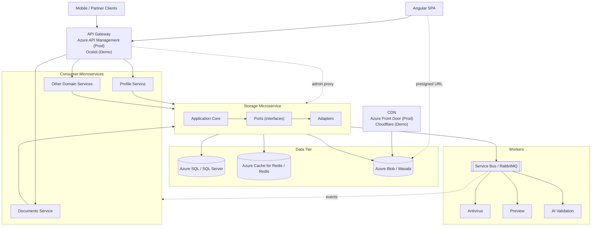
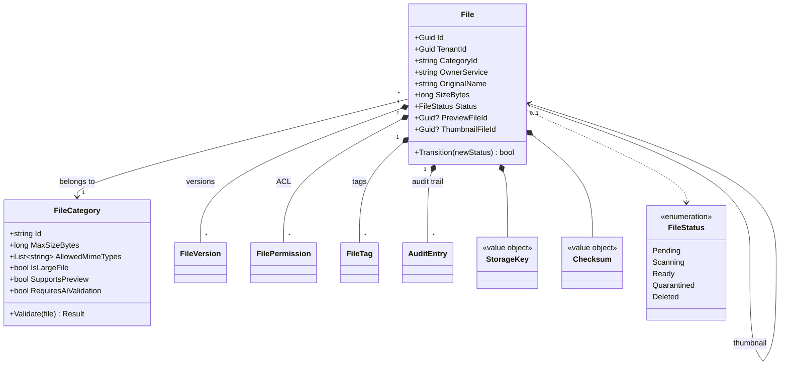
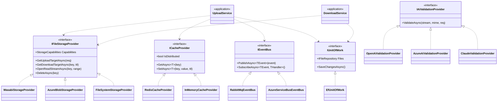

# Storage Microservice — Solution Architecture Design

> **Canonical architecture reference for Claude Code.**
> Read this first when working in this repository. Sections 6 (Low-Level Design) and 10 (Ports and Adapters) contain the source-of-truth contracts; everything else explains intent.

**Stack:** .NET 10 · Angular · Azure (production) · Wasabi / RabbitMQ / Redis / Ocelot (demo) · Pluggable adapters via Ports and Adapters.

---

## Table of Contents

1. [Task Statement](#1-task-statement)
2. [Executive Summary](#2-executive-summary)
3. [Functional Requirements](#3-functional-requirements)
4. [Non-Functional Requirements](#4-non-functional-requirements)
5. [High-Level Design](#5-high-level-design)
6. [Low-Level Design](#6-low-level-design)
7. [Storage Type — How Files Are Saved and Retrieved](#7-storage-type--how-files-are-saved-and-retrieved)
8. [Communication With Other Microservices](#8-communication-with-other-microservices)
9. [Technology Stack](#9-technology-stack)
10. [Architecture Pattern — Ports and Adapters](#10-architecture-pattern--ports-and-adapters)
11. [Azure Deployment Topology](#11-azure-deployment-topology)
12. [Sample Microservices Using the Storage Hub](#12-sample-microservices-using-the-storage-hub)
13. [Demo and Local Development Setup](#13-demo-and-local-development-setup)
14. [DevOps and Delivery Pipeline](#14-devops-and-delivery-pipeline)
15. [Testing Strategy](#15-testing-strategy)
16. [Security Architecture](#16-security-architecture)
17. [Observability and SLOs](#17-observability-and-slos)
18. [Localisation and Regional Compliance](#18-localisation-and-regional-compliance)
19. [Caveats and Recommendations](#19-caveats-and-recommendations)
20. [Implementation Roadmap](#20-implementation-roadmap)
21. [Conclusion](#21-conclusion)

---

## 1. Task Statement

Design a storage microservice that can store files of any extension and act as a storage hub for all other microservices. The design must indicate:

1. The functional and non-functional requirements for this microservice.
2. The high-level and low-level design for the microservice.
3. The type of the storage that will be used and why, and how files will be saved and retrieved.
4. How the other microservices will communicate with the newly designed one.

---

## 2. Executive Summary

The Storage Microservice is the single, opinionated hub responsible for storing and retrieving binary content of any type across the platform. No other microservice owns file bytes directly; every file in the system is registered with the Storage Service, which owns the metadata, governs access, and brokers the physical bytes through an object storage backend.

The design follows the **Ports and Adapters (Hexagonal)** architectural pattern. The application core depends only on abstractions for storage, cache, messaging, and persistence. Concrete adapters wire these abstractions to specific technologies, selected at startup by configuration. The same codebase runs against Wasabi or Azure Blob Storage in production and against the local file system in development; against Redis or Azure Cache for Redis in distributed deployments and against an in-memory cache in single-node demos; against RabbitMQ on premise and Azure Service Bus in the cloud.

The service is built on **.NET 10** with **Entity Framework Core** targeting **SQL Server**, exposes a versioned REST API for synchronous operations, publishes domain events over a message broker for asynchronous integration, and offloads bandwidth-intensive file traffic through **pre-signed URLs** so the service itself never handles the bytes. Front-end clients (**Angular**) and consuming microservices interact through a uniform client SDK.

**Production target: Microsoft Azure.** Azure Blob Storage, Azure SQL Database, Azure Cache for Redis, Azure Service Bus, Azure API Management, Azure Front Door, Microsoft Entra ID, Azure Key Vault. Secrets are referenced from Key Vault; workloads authenticate via managed identity. **Demo / local development:** Wasabi free tier, RabbitMQ, open-source Redis, SQL Server in Docker, Ocelot for the gateway, Keycloak for identity, Cloudflare free tier for CDN. Application code is identical across both environments.

---

## 3. Functional Requirements

### 3.1 File Upload
- Single-shot upload for small files (up to 10 MB by default, configurable per category) via pre-signed URL or proxy.
- Multipart, chunked, resumable upload for large files (up to 5 TB) using pre-signed per-part URLs.
- Accepts any MIME type and any extension; the service itself is content-agnostic. Constraints are enforced per **FileCategory** (see §6.1).
- Idempotency keys supported on upload initiation to safely retry failed uploads.

### 3.2 File Download
- Direct, streaming download via short-lived pre-signed URL.
- HTTP Range requests supported for partial reads (resumable downloads, media seeking).
- CDN-fronted delivery for hot or public files.
- Optional proxied download (server-mediated) for audited or internal-only flows.

### 3.3 Metadata Management
Each file row stores: original filename, MIME type, size, SHA-256 checksum, owner service, owner tenant, owner user, **category**, custom tags, description, classification, status (`pending` / `scanning` / `ready` / `quarantined` / `deleted`), current version, preview/thumbnail pointers, timestamps.

### 3.4 Versioning
Preserve previous versions under the same logical file ID; list versions with their checksums and timestamps; roll back to a prior version.

### 3.5 Deletion
Soft delete with configurable grace period (default 30 days); hard delete by explicit policy or admin operation; bulk deletion for tenant offboarding or compliance erasure.

### 3.6 Search and Listing
Paginated listing filtered by tenant, owner service, owner user, category, MIME type, tags, date range, and full-text search on filename. Sort by created date, size, name. Cursor-based pagination.

### 3.7 Access Control
- Service-level permissions: which microservices can read, write, or delete which files.
- User-level permissions: per-file ACL for end users.
- Pre-signed URL generation with caller-bound TTL and operation scope.
- Public sharing via tokenised share links with optional expiry and password.

### 3.8 Integrity and Safety
- SHA-256 checksum on upload, verified on download.
- Antivirus scan on every uploaded file before the file is marked `ready`.
- Quarantine workflow for files that fail the scan.

### 3.9 Lifecycle
- Automatic archival of cold files to lower-cost storage tiers after N days.
- Automatic deletion after a configurable retention window.
- Cleanup of orphaned pending uploads after 24 hours.

### 3.10 Audit and Observability
- Every mutation logged (who, what, when, from where).
- Structured request and event logs; trace correlation across services.

### 3.11 Multi-Tenancy
- Strict tenant isolation at the metadata and storage-key level.
- Per-tenant quotas (storage volume, request rate, max object size).

---

## 4. Non-Functional Requirements

| Attribute | Target |
|---|---|
| **Scalability** | Stateless API layer scales horizontally on Kubernetes (HPA). Designed for 10,000+ RPS and petabyte-scale data. |
| **Availability** | 99.95% SLA. Multi-AZ deployment with no single point of failure. Optional multi-region active/passive. |
| **Durability** | 99.999999999% (11 nines) for stored bytes (S3-class object stores). |
| **Performance** | P95 metadata ops < 100 ms; upload initiation < 200 ms; download throughput limited by object store + CDN bandwidth. |
| **Security** | TLS 1.3 in transit; AES-256 at rest via SSE-KMS; mTLS or signed JWT for service-to-service; signed/expiring URLs; per-tenant key isolation. |
| **Compliance** | GDPR (right to erasure, data residency); configurable region pinning; HIPAA-ready architecture if needed. |
| **Resiliency** | Circuit breakers on downstream dependencies; retries with exponential backoff + jitter; idempotency keys; DLQs for failed async work. |
| **Cost efficiency** | Tiered storage classes (hot/warm/cold) with lifecycle rules; CDN offload; pre-signed URLs to remove the service from the bandwidth path. |
| **Disaster recovery** | Cross-region replication; PITR for SQL Server; RPO < 15 min; RTO < 1 hour; quarterly DR drills. |
| **Observability** | Structured logs (Serilog); RED metrics via OpenTelemetry; distributed tracing; domain dashboards. |
| **Maintainability** | Versioned API; backward-compatible contracts; infrastructure as code (Terraform); CI/CD with automated tests. |

---

## 5. High-Level Design

Consumer microservices never interact with the storage backends directly; they always go through the Storage Microservice for metadata operations and through pre-signed URLs for byte transfer.

### 5.1 Component Responsibilities

**API Gateway** — Terminates TLS, performs coarse authentication, applies rate limits, enforces request size caps and CORS, forwards calls to the storage cluster. Production: Azure API Management. Demo: Ocelot.

**Storage Microservice** — Stateless .NET 10 minimal API service on Kubernetes with HPA. Three responsibilities only: authorise the operation, manage metadata in SQL Server, broker byte transfer using pre-signed URLs.

**SQL Server (Metadata Store)** — All file metadata, permissions, versions, tags, audit. Reached via EF Core 10. Production: Azure SQL Database with active geo-replication. Demo: SQL Server in Docker.

**Redis (Distributed Cache)** — Hot metadata, idempotency keys, rate-limit counters per tenant, short-lived pre-signed URLs cached within their TTL. Production: Azure Cache for Redis (Premium for geo-replication). Demo: open-source Redis.

**Object Storage** — File bytes, with versioning, SSE, lifecycle rules, and event notifications configured at this layer. Production: Azure Blob Storage. Demo: Wasabi (S3-compatible, generous free tier, no egress fees). Local development: file system.

**Event Bus** — Carries domain events. Production: Azure Service Bus (Premium tier minimum). Demo: RabbitMQ in Docker. MassTransit abstracts both transports through a single API.

**CDN** — Edge caching of public reads. Production: Azure Front Door (Premium, with WAF). Demo: Cloudflare (free tier).

**Antivirus Scanner** — Consumes `file.uploaded`, scans, publishes `file.scanned`. ClamAV in both demo and production; Microsoft Defender for Cloud can supplement in Azure.

### 5.2 System Architecture Diagram

The diagram below shows the runtime topology end-to-end. Solid arrows are synchronous HTTPS calls; dotted arrows are pre-signed URL byte transfer or asynchronous event consumption.


*Figure 1. End-to-end system architecture. Production components are labelled (Prod); demo equivalents are labelled (Demo). The same application code runs against either set of adapters.*

<details>
<summary>Mermaid source (click to expand and edit)</summary>



</details>

---

## 6. Low-Level Design

### 6.1 File Categories and Upload Policy

Validation rules — maximum size, allowed MIME types, allowed extensions, large-file flag, preview support — are **properties of a FileCategory**, not of the upload endpoint. Consumer microservices pass a category identifier; the Storage Service enforces the policy.

This keeps validation centralised, auditable, and operable. Policy changes — tightening an extension list after a security incident, raising a limit for a premium tenant, enabling preview generation for a new content type — are configuration changes against a single table, not code changes across every consumer.

#### Category Schema

```sql
CREATE TABLE FileCategories (
    Id                       VARCHAR(64)      PRIMARY KEY,  -- e.g. 'avatar', 'deliverable'
    DisplayName              NVARCHAR(256)    NOT NULL,
    MaxSizeBytes             BIGINT           NOT NULL,
    AllowedMimeTypes         NVARCHAR(2000)   NOT NULL,     -- JSON array
    AllowedExtensions        NVARCHAR(2000)   NOT NULL,     -- JSON array
    IsLargeFile              BIT              NOT NULL DEFAULT 0,
    MultipartThresholdBytes  BIGINT           NULL,
    Visibility               VARCHAR(16)      NOT NULL,     -- 'private' | 'public'
    SupportsPreview          BIT              NOT NULL DEFAULT 0,
    PreviewStrategy          VARCHAR(64)      NULL,         -- 'image-thumbnails', 'pdf-first-page', 'video-poster'
    ThumbnailSizes           NVARCHAR(256)    NULL,         -- JSON array of pixel dims
    AntivirusRequired        BIT              NOT NULL DEFAULT 1,
    RetentionDays            INT              NULL,         -- NULL = no auto-purge
    LifecycleTier            VARCHAR(16)      NOT NULL,     -- 'hot' | 'cool' | 'archive'
    AllowedOwnerServices     NVARCHAR(1000)   NOT NULL,     -- JSON array of service IDs
    CreatedAt                DATETIME2(3)     NOT NULL,
    UpdatedAt                DATETIME2(3)     NOT NULL
);
```

#### Starter Category Set

| Category | Max size | Allowed types | Large? | Preview |
|---|---|---|---|---|
| `avatar` | 5 MB | jpeg, png, webp | No | Image thumbnails (64, 256) |
| `company-logo` | 2 MB | svg, png | No | Direct image |
| `document` | 100 MB | pdf, docx, xlsx, pptx | No | PDF first-page render |
| `deliverable` | 1 GB | broad allow-list | Yes | None |
| `project-archive` | 5 TB | zip, tar, 7z | Yes | None |
| `video` | 5 GB | mp4, mov, webm | Yes | Poster frame |
| `signed-contract` | 50 MB | pdf | No | PDF first-page render |

Categories are deliberately few at the start. Adding a category is one row in `FileCategories` — introduce new ones as real consumer needs emerge, not predicted upfront.

#### Per-Tenant Overrides (future)

A second table, `FileCategoryOverrides`, keyed on `(CategoryId, TenantId)`, can store tenant-specific overrides of any field. The application reads the base category and applies the override at validation time. Not required at launch; the schema accommodates it from day one.

#### Validation Flow

On every upload initiation:
1. Resolve the `FileCategory` by ID. Reject 400 if unknown.
2. Verify caller's `OwnerService` appears in `AllowedOwnerServices`. Reject 403 otherwise.
3. Validate declared MIME type against `AllowedMimeTypes`. Reject 415 on mismatch.
4. Validate file extension against `AllowedExtensions`. Reject 415 on mismatch.
5. Validate declared `SizeBytes` against `MaxSizeBytes`. Reject 413 if exceeded.
6. If `IsLargeFile=true`, force the multipart upload flow regardless of declared size.
7. Record the resolved category on the `Files` row so it travels with the metadata.

**Why categories beat endpoint variants:** splitting the API into `POST /v1/images`, `POST /v1/documents`, `POST /v1/videos` is the wrong abstraction. From the Storage Microservice's perspective an image and a PDF are equally bytes-plus-metadata. The difference lives in the category policy, the downstream worker that handles previews, and the frontend component that picks the file.

### 6.2 REST API Contract

All endpoints versioned at `/v1`. Service-to-service callers send a signed JWT or mTLS-authenticated request. End-user-initiated requests carry the user's JWT for per-user ACL enforcement.

| Endpoint | Purpose |
|---|---|
| `POST /v1/files` | Initiate upload. Requires `category`. Validates size, MIME type, extension against `FileCategory`. Returns `{ fileId, uploadUrl, uploadHeaders, expiresAt, proxyRequired, multipartRequired }`. |
| `POST /v1/files/{id}/complete` | Client confirms upload. Triggers antivirus scan; publishes `file.uploaded`. |
| `POST /v1/files/{id}/parts` | Multipart: returns pre-signed URLs for each part. |
| `POST /v1/files/{id}/parts/complete` | Finalise multipart upload. |
| `GET /v1/files/{id}` | Returns metadata (including category) plus short-lived `downloadUrl` and `previewUrl`/`thumbnailUrl` if available. |
| `GET /v1/files/{id}/content` | Optional proxy download with Range support. Audited stream. |
| `PATCH /v1/files/{id}` | Update metadata, tags, permissions. |
| `DELETE /v1/files/{id}` | Soft delete. `?hard=true` for permanent purge (privileged). |
| `GET /v1/files?owner=&category=&tag=&mime=&page=` | List with filters and cursor-based pagination. |
| `POST /v1/files/{id}/versions` | Create a new version. |
| `GET /v1/files/{id}/versions` | List all versions. |
| `POST /v1/files/{id}/share` | Generate a public or scoped share URL with TTL and optional password. |
| `GET /v1/categories` | List all `FileCategories`. Used by frontends to render appropriate pickers and validate client-side. |
| `GET /v1/categories/{id}` | Get a single category's policy. |

**Common headers and conventions:**
- `Authorization: Bearer <jwt>` or mTLS at the transport layer.
- `Idempotency-Key` on POSTs.
- `X-Tenant-Id` propagated by the gateway.
- `traceparent` for distributed tracing.

### 6.3 Data Model (SQL Server)

```sql
CREATE TABLE Files (
    Id                   UNIQUEIDENTIFIER PRIMARY KEY,
    TenantId             UNIQUEIDENTIFIER NOT NULL,
    CategoryId           VARCHAR(64)      NOT NULL,
    OwnerService         VARCHAR(64)      NOT NULL,
    OwnerUserId          UNIQUEIDENTIFIER NULL,
    OriginalName         NVARCHAR(512)    NOT NULL,
    MimeType             VARCHAR(128)     NOT NULL,
    SizeBytes            BIGINT           NOT NULL,
    ChecksumSha256       CHAR(64)         NULL,
    StorageBucket        VARCHAR(128)     NOT NULL,
    StorageKey           VARCHAR(1024)    NOT NULL,
    Status               VARCHAR(32)      NOT NULL,
    CurrentVersion       INT              NOT NULL DEFAULT 1,
    PreviewFileId        UNIQUEIDENTIFIER NULL,   -- pointer to generated preview
    ThumbnailFileId      UNIQUEIDENTIFIER NULL,   -- pointer to small thumbnail
    CreatedAt            DATETIME2(3)     NOT NULL,
    UpdatedAt            DATETIME2(3)     NOT NULL,
    DeletedAt            DATETIME2(3)     NULL,
    CONSTRAINT CK_Files_Status CHECK
      (Status IN ('pending','scanning','ready','quarantined','deleted')),
    CONSTRAINT FK_Files_Category    FOREIGN KEY (CategoryId)      REFERENCES FileCategories(Id),
    CONSTRAINT FK_Files_Preview     FOREIGN KEY (PreviewFileId)   REFERENCES Files(Id),
    CONSTRAINT FK_Files_Thumbnail   FOREIGN KEY (ThumbnailFileId) REFERENCES Files(Id)
);
CREATE INDEX IX_Files_Tenant_Owner    ON Files (TenantId, OwnerService);
CREATE INDEX IX_Files_Tenant_Status   ON Files (TenantId, Status);
CREATE INDEX IX_Files_Tenant_Category ON Files (TenantId, CategoryId);
CREATE INDEX IX_Files_Checksum        ON Files (ChecksumSha256);

CREATE TABLE FileVersions (
    FileId               UNIQUEIDENTIFIER NOT NULL,
    VersionNumber        INT              NOT NULL,
    StorageKey           VARCHAR(1024)    NOT NULL,
    SizeBytes            BIGINT           NOT NULL,
    ChecksumSha256       CHAR(64)         NULL,
    CreatedAt            DATETIME2(3)     NOT NULL,
    CONSTRAINT PK_FileVersions PRIMARY KEY (FileId, VersionNumber),
    CONSTRAINT FK_FileVersions_Files FOREIGN KEY (FileId) REFERENCES Files(Id)
);

CREATE TABLE FilePermissions (
    FileId               UNIQUEIDENTIFIER NOT NULL,
    PrincipalType        VARCHAR(16)      NOT NULL, -- 'service' | 'user'
    PrincipalId          VARCHAR(128)     NOT NULL,
    Permission           VARCHAR(16)      NOT NULL, -- 'read' | 'write' | 'delete'
    CONSTRAINT PK_FilePermissions PRIMARY KEY (FileId, PrincipalType, PrincipalId, Permission),
    CONSTRAINT FK_FilePermissions_Files FOREIGN KEY (FileId) REFERENCES Files(Id)
);

CREATE TABLE FileTags (
    FileId               UNIQUEIDENTIFIER NOT NULL,
    [Key]                VARCHAR(64)      NOT NULL,
    [Value]              NVARCHAR(256)    NOT NULL,
    CONSTRAINT PK_FileTags PRIMARY KEY (FileId, [Key]),
    CONSTRAINT FK_FileTags_Files FOREIGN KEY (FileId) REFERENCES Files(Id)
);
CREATE INDEX IX_FileTags_Key_Value ON FileTags ([Key], [Value]);

CREATE TABLE AuditLog (
    Id                   BIGINT IDENTITY(1,1) PRIMARY KEY,
    FileId               UNIQUEIDENTIFIER NULL,
    Actor                NVARCHAR(256)    NOT NULL,
    Action               VARCHAR(64)      NOT NULL,
    Ip                   VARCHAR(64)      NULL,
    UserAgent            NVARCHAR(512)    NULL,
    OccurredAt           DATETIME2(3)     NOT NULL,
    Metadata             NVARCHAR(MAX)    NULL  -- JSON
);
CREATE INDEX IX_AuditLog_FileId_OccurredAt ON AuditLog (FileId, OccurredAt DESC);
```

### 6.4 Upload Sequence

1. Caller sends `POST /v1/files` with `category`, file name, MIME type, declared size, tenant, intended permissions, `Idempotency-Key` header.
2. Storage Microservice resolves the `FileCategory`, validates caller's `OwnerService` against `AllowedOwnerServices`, and validates MIME type, extension, and size against the category policy. Any failure returns a precise 4xx (400 / 403 / 413 / 415) before any storage operation runs.
3. Service authorises against per-service permissions, generates a UUID, computes storage key: `<tenantId>/<yyyy>/<mm>/<dd>/<uuid>`. The date-based prefix prevents hotspots in the object store.
4. Service inserts a `Files` row with `Status=pending`, the resolved `CategoryId`, and the storage location. If `IsLargeFile=true`, the multipart flow is initiated immediately regardless of declared size.
5. For small files: service requests a pre-signed PUT URL (15-min TTL by default, SSE-KMS headers baked in). For large files: service returns a multipart upload ID; client follows up with `POST /v1/files/{id}/parts` to get per-part URLs.
6. Service returns `{ fileId, uploadUrl, uploadHeaders, expiresAt, proxyRequired, multipartRequired }`. Client uploads bytes directly to the object store.
7. On completion: client calls `POST /v1/files/{id}/complete` with computed checksum. Service verifies, flips `Status=scanning`, publishes `file.uploaded`.
8. Antivirus worker consumes the event, scans, publishes `file.scanned` with the verdict.
9. If the category's `SupportsPreview=true`, a preview worker (image, PDF, or video) generates the preview asset, uploads it as a new file, and emits `file.preview_ready` with both the original `FileId` and the generated `PreviewFileId`/`ThumbnailFileId`. The original file's row is updated.
10. Storage Microservice flips `Status` to `ready` (or `quarantined`), publishes `file.ready`.
11. Subscribed consumer microservices update their own state.

### 6.5 Download Sequence

1. Client sends `GET /v1/files/{id}` with their JWT or service token.
2. Service authorises against per-service and per-user ACLs, reads metadata (Redis first, SQL Server on miss), ensures `Status=ready`.
3. Service generates a pre-signed GET URL (default 15-min TTL). For hot/public content, issues a CDN-signed URL instead. Pre-signed URLs are cached in Redis under `presigned:get:{fileId}:{principal}` with TTL slightly shorter than the URL itself.
4. Service returns metadata plus `downloadUrl` (and `previewUrl`/`thumbnailUrl` if present).
5. Client streams bytes directly from the object store or CDN. HTTP Range requests are supported natively.
6. Every successful download URL generation is logged in `AuditLog`.

### 6.6 AI-Powered Content Validation (Future, Info Only)

Some `FileCategories` — profile photos, passport scans, national ID cards, signed contracts — benefit from automated content validation that goes beyond MIME type and extension checking. A passport scan needs to actually look like a passport, not just have a `.jpg` extension. A profile photo needs to be a person, not a logo or a screenshot of text. This section describes how such validation will be added to the design when needed; **it is not implemented in the initial release.**

#### Category-Level Flags

Three columns extend the `FileCategories` table:

```sql
ALTER TABLE FileCategories ADD
    RequiresAiValidation     BIT             NOT NULL DEFAULT 0,
    AiValidationStrategy     VARCHAR(64)     NULL,       -- 'profile-photo', 'passport', 'id-card', 'signature'
    AiValidationPrompt       NVARCHAR(2000)  NULL;       -- override prompt; null = use strategy default
```

And the `Files` table records the verdict alongside the antivirus scan result:

```sql
ALTER TABLE Files ADD
    AiValidationStatus       VARCHAR(32)     NULL,       -- 'pending', 'approved', 'rejected', 'needs_review'
    AiValidationVerdict      NVARCHAR(MAX)   NULL;       -- JSON: verdict, confidence, rationale, strategy
```

#### Example Categories With AI Validation

| Category | Requires AI | Strategy | What is validated |
|---|---|---|---|
| `avatar` | Yes | `profile-photo` | Clear photo of a single person's face. Not a logo, illustration, group photo, or screenshot of text. |
| `passport-scan` | Yes | `passport` | Valid passport book format. MRZ visible. Photo readable. No obvious tampering or edits. |
| `national-id` | Yes | `id-card` | Valid ID card format with the required fields visible. Front side, not back. |
| `signed-contract` | Yes | `signature` | Document contains a visible signature in the expected region. |
| `document` | No | — | Generic document; no AI validation needed. |

#### Validation Flow Extension

The upload sequence (§6.4) gains a new step between antivirus scanning and the file being marked ready:

```
file.uploaded → antivirus scan → file.scanned (clean)
              → AI validation worker → file.ai_validated
              → status: ready | rejected | needs_human_review
```

If the category has `RequiresAiValidation=true`, a new worker picks up `file.scanned` events, streams the file from object storage, calls the AI provider with the appropriate strategy and prompt, and publishes `file.ai_validated`. The Storage Service then flips the status accordingly. Rejected files are quarantined but retained for an audit window. Low-confidence verdicts (configurable threshold, typically below 0.85) route to a `needs_human_review` queue rather than auto-rejecting — the worst failure mode is a manual review, not a wrongly accepted document.

#### Pluggable AI Provider

Following the same Ports and Adapters pattern as storage and cache, a new abstraction:

```csharp
public interface IAiValidationProvider
{
    Task<AiValidationResult> ValidateAsync(
        Stream content, string mimeType,
        AiValidationRequest request, CancellationToken ct);
}

public sealed record AiValidationRequest(
    string Strategy,                          // 'profile-photo', 'passport', etc.
    string? CustomPrompt,                     // overrides the strategy default
    Dictionary<string, string> Context);      // tenant, user, etc.

public sealed record AiValidationResult(
    AiValidationVerdict Verdict,              // approved | rejected | needs_review
    double Confidence,                        // 0.0 to 1.0
    string Rationale,                         // model's explanation
    Dictionary<string, object> Details);      // strategy-specific structured fields
```

Concrete adapters mirror the storage/cache pluggability:

- **OpenAiValidationProvider** — calls OpenAI's `gpt-4o` vision capabilities with strategy-specific system prompts and JSON structured output mode.
- **AzureAiValidationProvider** — uses Azure AI Content Safety and Azure AI Vision. Lives in the same Azure tenant; no data leaves Azure. Important for compliance-sensitive content (IDs, passports).
- **ClaudeValidationProvider** — uses Anthropic's vision models. Useful as a second-opinion path or fallback for low-confidence verdicts.
- **MockValidationProvider** — for demo and tests; returns deterministic verdicts based on file name conventions.

Provider is selected by configuration like the other adapters. Multi-provider strategies are possible (run two providers, require agreement, escalate disagreements to human review).

#### New Event

| Event | Description |
|---|---|
| `file.ai_validated` | AI content validation complete. Payload includes verdict (`approved` / `rejected` / `needs_review`), confidence (0.0–1.0), rationale, and strategy. Only emitted for files whose category has `RequiresAiValidation=true`. |

#### Considerations

- **Cost:** vision-model calls are expensive at scale. Per-tenant quotas on AI validation requests prevent budget overruns.
- **Latency:** vision calls typically take 2–10 seconds. The upload itself completes synchronously; the client sees status updates via WebSocket or polling. The Angular component (§12.5) handles this transparently.
- **Privacy and data residency:** AI validation must respect data residency requirements. Identity documents and similar sensitive content should prefer the Azure AI provider for in-tenant processing. Per-tenant configuration can disable AI validation entirely.
- **Audit:** every AI validation call is logged with the prompt, response, verdict, confidence, and provider identifier. Required for compliance review and model-drift investigation.
- **Human-in-the-loop:** a `needs_human_review` queue with an admin UI is required from day one for any tenant using AI validation. Without it, low-confidence verdicts have no resolution path.
- **Prompt versioning:** strategy prompts must be version-controlled. A prompt change is a behaviour change and should be rolled out with the same care as a code change.

---

## 7. Storage Type — How Files Are Saved and Retrieved

### 7.1 Choice: S3-Compatible Object Storage for Bytes, SQL Server for Metadata

| Option | Why rejected |
|---|---|
| Files inside SQL Server (FILESTREAM or `varbinary`) | Bloats transaction log, breaks backup windows, ruins buffer-pool cache hit ratios, caps file size at row limits, saturates DB I/O with bandwidth-heavy traffic. |
| Block storage (Azure Disk, EBS, Ceph RBD) | Single-attach by design; does not scale across nodes without significant engineering; expensive per GB; no native HTTP access. |
| Network file system (NFS, EFS, Azure Files) | Works but expensive per GB, slower than object storage at scale, suffers under millions of small objects, operationally heavy. |
| Self-hosted file server | SPOF, operational liability, no durability guarantees, no native versioning or lifecycle. |

**Object storage wins on every dimension:**
- Designed for arbitrary file types and sizes (up to terabyte-class objects).
- Horizontal scalability across billions of objects per bucket.
- Durability of 11 nines via cross-AZ replication or erasure coding.
- Cost: ~order of magnitude cheaper per GB than block storage; tiered classes for lifecycle savings.
- HTTP-native: pre-signed URLs remove the Storage Microservice from the byte path.
- Built-in: SSE, versioning, lifecycle, event notifications, cross-region replication, object lock.
- Vendor-portable: S3 API is supported by Wasabi, AWS, Azure Blob (via gateway), GCS, MinIO. Azure Blob has a native first-class adapter.

### 7.2 Provider Strategy

**Production: Azure Blob Storage.** Hot/cool/archive tiers for lifecycle management; native Azure Front Door integration for CDN; Microsoft Entra ID RBAC/ABAC access control; Azure Key Vault for customer-managed encryption keys. ZRS by default, GRS available for stricter compliance. The Azure Blob adapter uses the `Azure.Storage.Blobs` SDK and emits SAS URIs as pre-signed URL equivalents.

**Demo: Wasabi.** Fully S3-compatible; AWSSDK.S3 targets Wasabi by overriding `ServiceURL`. Generous free tier, no egress fees. Same `StorageCapabilities` profile as Azure Blob.

**Development: File System.** Files written to a configured root directory and served through the service's proxy endpoint. `SupportsPresignedUploadUrls=false` — the application layer transparently switches to the proxy upload flow.

### 7.3 How Files Are Saved

1. Client initiates upload by calling `POST /v1/files` with metadata.
2. Service generates UUID and a deterministic storage key: `<tenantId>/<yyyy>/<mm>/<dd>/<uuid>`. Date prefix prevents hot partitions.
3. Pre-signed PUT URL generated with 15-min TTL. SSE-KMS headers baked into the signed URL.
4. For files > 100 MB: multipart upload initiated; per-part pre-signed URLs (5–100 MB per part) issued, enabling parallel/resumable uploads.
5. Client uploads bytes directly. Service never sees them.
6. After completion: SHA-256 checksum verified against client-supplied value. `Files` row marked `scanning`; antivirus pipeline runs.
7. Versioning is enabled at the bucket level; the service tracks version IDs in `FileVersions`.

### 7.4 How Files Are Retrieved

1. Client calls `GET /v1/files/{id}`.
2. Service returns metadata + pre-signed GET URL (default 15-min TTL, configurable up to a max).
3. Client requests bytes directly from object store. HTTP Range supported for partial reads.
4. For hot/public content: service returns a CDN-signed URL. CDN caches the object at the edge after the first miss.
5. For audited internal streams: `GET /v1/files/{id}/content` proxies through the service. Exception, not default.

---

## 8. Communication With Other Microservices

A blend of synchronous and asynchronous channels — each used for what it does best.

### 8.1 Synchronous: REST over HTTPS

Other microservices call the Storage Microservice for all CRUD-style operations. REST is the default; gRPC valid for chatty service-to-service paths.

**Ground rules:**
- Clients never proxy file bytes through the Storage Microservice. They always receive a pre-signed URL and talk to the object store directly.
- Clients always send a service token (signed JWT or mTLS cert).

### 8.2 Asynchronous: Event-Driven via RabbitMQ / Azure Service Bus

| Event | Description |
|---|---|
| `file.created` | New metadata record. Status: `pending`. |
| `file.uploaded` | Bytes uploaded and checksum verified. Status: `scanning`. |
| `file.scanned` | Antivirus complete. Payload includes verdict. |
| `file.preview_ready` | Preview/thumbnail generated. Payload includes original `FileId` and `PreviewFileId`/`ThumbnailFileId` pointers. Only emitted for categories with `SupportsPreview=true`. |
| `file.ready` | File fully available. Status: `ready`. |
| `file.deleted` | Soft or hard delete. |
| `file.permission_changed` | ACL modified. |

Each event carries `fileId`, `tenantId`, `ownerService`, timestamp, and just enough metadata for routing. No payload bytes.

**Implementation:** MassTransit. Natively supports RabbitMQ and Azure Service Bus through a single API — broker choice is a configuration change, not a code change. `IEventBus` is a thin facade over MassTransit's `IBus`.

### 8.3 Pre-Signed URLs as a Third Communication Style

Pre-signed URLs let the Storage Microservice hand off bandwidth-intensive operations to the object store while controlling who can do what for how long. This pattern is what makes the service horizontally cheap regardless of file sizes.

### 8.4 Client SDK

Thin client libraries for the primary platforms (.NET, TypeScript). The SDK encapsulates authentication, retry-with-jitter, multipart chunking, idempotency-key handling, checksum verification, and event subscription.

### 8.5 Authentication Between Services

Two acceptable patterns:
- **mTLS** via a service mesh (Linkerd, Istio, Dapr) — stronger guarantees, heavier operations.
- **Signed JWTs** issued by a central auth service (Keycloak in demo, Microsoft Entra ID in production) — easier to roll out incrementally.

For end-user operations, the user's JWT is forwarded so the Storage Microservice can apply user-level permissions on top of service-level ones.

### 8.6 Reliability Primitives for Every Consumer

- Send `Idempotency-Key` on POSTs.
- Honour `Retry-After` on 429s.
- Use exponential backoff with jitter.
- Treat the service as eventually consistent for newly uploaded files. Use the `file.ready` event, not a polling loop.

---

## 9. Technology Stack

### 9.1 Production vs Demo Mapping

| Layer | Production (Azure) | Demo / Local |
|---|---|---|
| API gateway | Azure API Management | Ocelot (.NET reverse proxy) |
| CDN | Azure Front Door | Cloudflare (free tier) |
| Object storage | Azure Blob Storage | Wasabi free tier; file system for unit tests |
| Metadata database | Azure SQL Database | SQL Server in Docker or SQL Server Express |
| Cache | Azure Cache for Redis | Redis in Docker; in-memory for unit tests |
| Event bus | Azure Service Bus | RabbitMQ in Docker; in-memory for unit tests |
| Identity | Microsoft Entra ID | Keycloak container or local JWT issuer |
| Secrets | Azure Key Vault | .NET user secrets and environment variables |
| Observability | Application Insights + Azure Monitor | Serilog console + Prometheus + Grafana |
| Orchestration | Azure Kubernetes Service (AKS) | Docker Compose |
| Antivirus | ClamAV sidecar on AKS or Defender for Cloud | ClamAV container |
| Frontend hosting | Azure Static Web Apps or App Service | `ng serve` |
| Infrastructure as code | Terraform (Azure-native, single codebase) | Docker Compose |
| CI/CD | Azure DevOps Pipelines or GitHub Actions | Same pipelines, local registry |

Provider selection is configuration-driven; no application code changes between production and demo.

### 9.2 Component / Library Detail

| Layer | Implementation |
|---|---|
| Runtime | .NET 10 (LTS) |
| Language | C# (latest) |
| Web framework | ASP.NET Core Minimal APIs |
| Frontend | Angular (latest stable) |
| ORM | EF Core 10 with `Microsoft.EntityFrameworkCore.SqlServer` |
| Database | Azure SQL Database (prod) / SQL Server in Docker (demo) |
| Azure Blob adapter | `Azure.Storage.Blobs` SDK |
| Wasabi adapter | `AWSSDK.S3` with custom `ServiceURL` |
| File system adapter | `System.IO` |
| Redis client | `StackExchange.Redis` (identical for Azure Cache for Redis and OSS Redis) |
| Messaging library | MassTransit (RabbitMQ + Azure Service Bus through single API) |
| API gateway | Azure API Management (prod) / Ocelot (demo) |
| CDN | Azure Front Door (staging/prod) / Cloudflare (demo) |
| Antivirus | ClamAV or Microsoft Defender for Cloud |
| Authentication | `Microsoft.AspNetCore.Authentication.JwtBearer`; `Microsoft.Identity.Web` for Entra ID |
| Image processing (Profile sample) | ImageSharp |
| Observability | OpenTelemetry + Serilog; Application Insights exporter in production |
| Infrastructure as code | Terraform (prod) / Docker Compose (demo) |
| CI/CD | Azure DevOps Pipelines or GitHub Actions |

---

## 10. Architecture Pattern — Ports and Adapters

The application core depends only on abstractions ("ports") expressed as C# interfaces. Each abstraction has one or more concrete implementations ("adapters") that wire it to a specific technology. Switching providers is a configuration change at startup, not a refactor.

### 10.1 Class Diagrams

Two class diagrams capture the design. The first focuses on the domain model (entities, value objects, enums) — what the service knows about the world. The second focuses on the Ports and Adapters layering — how the application core depends only on abstractions and how each abstraction has multiple concrete implementations selected at startup.

#### Domain Model

`File` is the aggregate root. It belongs to a `FileCategory` (the policy holder), has many versions, permissions, tags, and audit entries, and references value objects (`StorageKey`, `Checksum`) and enums (`FileStatus`, `Visibility`, `Permission`). `PreviewFileId` and `ThumbnailFileId` are self-references to other `File` rows that hold generated previews.


*Figure 2. Domain class model. `File` is the aggregate root; `FileCategory` holds the policy that constrains every file.*

<details>
<summary>Mermaid source (click to expand)</summary>



</details>

#### Ports and Adapters

Five port interfaces define the seams of the architecture. Each has multiple concrete adapters selected by configuration at startup. `UploadService` and `DownloadService` are the primary application-layer use cases; they depend on the ports, never on the concrete adapters.


*Figure 3. Ports (interfaces) above, adapters (concrete implementations) below. The `IAiValidationProvider` port and its three adapters are reserved for the future content-validation work described in §6.6.*

<details>
<summary>Mermaid source (click to expand)</summary>



</details>

### 10.2 Solution Structure

```
src/
├── Storage.Domain/                                 (entities, value objects, domain events)
├── Storage.Application/                            (use cases, DTOs, abstractions)
│   └── Abstractions/
│       ├── IFileStorageProvider.cs
│       ├── ICacheProvider.cs
│       ├── IEventBus.cs
│       └── IUnitOfWork.cs
├── Storage.Infrastructure.Persistence.SqlServer/   (EF Core, migrations, repositories)
├── Storage.Infrastructure.Storage.Wasabi/
├── Storage.Infrastructure.Storage.AzureBlob/
├── Storage.Infrastructure.Storage.FileSystem/
├── Storage.Infrastructure.Cache.Redis/
├── Storage.Infrastructure.Cache.InMemory/
├── Storage.Infrastructure.Messaging.RabbitMQ/
├── Storage.Infrastructure.Messaging.AzureServiceBus/
├── Storage.Sdk/                                    (client library for consuming services)
└── Storage.Api/                                    (minimal API host, DI wiring, OpenAPI)
```

`Storage.Application` and `Storage.Domain` reference nothing in the Infrastructure layer. Each adapter project references `Storage.Application` to implement the relevant abstraction. `Storage.Api` references all of them and registers concrete adapters at startup based on configuration.

### 10.3 Abstractions

#### IFileStorageProvider

```csharp
public interface IFileStorageProvider
{
    StorageCapabilities Capabilities { get; }

    Task<StoragePutResult> GetUploadTargetAsync(
        StoragePutRequest request, CancellationToken ct);

    Task<StorageGetResult> GetDownloadTargetAsync(
        string bucket, string key, TimeSpan ttl, CancellationToken ct);

    Task<Stream> OpenReadStreamAsync(
        string bucket, string key, RangeHeader? range, CancellationToken ct);

    Task WriteStreamAsync(
        string bucket, string key, Stream content, string contentType,
        CancellationToken ct);

    Task DeleteAsync(string bucket, string key, CancellationToken ct);
    Task<bool> ExistsAsync(string bucket, string key, CancellationToken ct);
}

public sealed record StorageCapabilities(
    bool SupportsPresignedUploadUrls,
    bool SupportsPresignedDownloadUrls,
    bool SupportsMultipartUpload,
    bool SupportsVersioning,
    bool SupportsServerSideEncryption,
    long MaxObjectSizeBytes);

public sealed record StoragePutResult(
    string? PresignedUrl,
    Dictionary<string, string>? Headers,
    bool ProxyRequired);
```

The `StorageCapabilities` flags are the cornerstone. The application layer branches once on `Capabilities.SupportsPresignedUploadUrls`; everything else is identical between cloud and file-system modes.

#### ICacheProvider

```csharp
public interface ICacheProvider
{
    bool IsDistributed { get; }

    Task<T?> GetAsync<T>(string key, CancellationToken ct);
    Task SetAsync<T>(string key, T value, TimeSpan? ttl, CancellationToken ct);
    Task RemoveAsync(string key, CancellationToken ct);
    Task<bool> ExistsAsync(string key, CancellationToken ct);
}
```

`IsDistributed` protects callers from accidentally using an in-memory cache for distributed locks, rate-limit counters, or idempotency keys. Operations requiring distribution check the flag and fall back to SQL Server when false.

#### IEventBus

```csharp
public interface IEventBus
{
    Task PublishAsync<TEvent>(TEvent @event, CancellationToken ct)
        where TEvent : IntegrationEvent;

    Task SubscribeAsync<TEvent, THandler>(CancellationToken ct)
        where TEvent : IntegrationEvent
        where THandler : IEventHandler<TEvent>;
}

public abstract record IntegrationEvent(
    Guid EventId, DateTime OccurredAt, string Source);

public sealed record FileUploadedEvent(
    Guid FileId, Guid TenantId, string OwnerService,
    string MimeType, long SizeBytes,
    Dictionary<string, string> Tags,
    Guid EventId, DateTime OccurredAt, string Source)
    : IntegrationEvent(EventId, OccurredAt, Source);
```

#### IUnitOfWork

```csharp
public interface IUnitOfWork
{
    IFileRepository           Files          { get; }
    IFileVersionRepository    FileVersions   { get; }
    IPermissionRepository     Permissions    { get; }
    IAuditRepository          Audit          { get; }

    Task<int> SaveChangesAsync(CancellationToken ct);
    Task ExecuteInTransactionAsync(Func<Task> work, CancellationToken ct);
}
```

EF Core is already an abstraction over relational engines; `IUnitOfWork` wraps `DbContext` so the application layer doesn't reference EF directly.

### 10.4 Concrete Adapters

#### WasabiStorageProvider

```csharp
public class WasabiStorageProvider : IFileStorageProvider
{
    private readonly IAmazonS3 _s3;
    private readonly WasabiOptions _opts;

    public StorageCapabilities Capabilities => new(
        SupportsPresignedUploadUrls:    true,
        SupportsPresignedDownloadUrls:  true,
        SupportsMultipartUpload:        true,
        SupportsVersioning:             true,
        SupportsServerSideEncryption:   true,
        MaxObjectSizeBytes:             5L * 1024 * 1024 * 1024 * 1024); // 5 TB

    public Task<StoragePutResult> GetUploadTargetAsync(
        StoragePutRequest req, CancellationToken ct)
    {
        var url = _s3.GetPreSignedURL(new GetPreSignedUrlRequest
        {
            BucketName  = req.Bucket,
            Key         = req.Key,
            Verb        = HttpVerb.PUT,
            Expires     = DateTime.UtcNow.Add(req.UrlTtl),
            ContentType = req.ContentType,
            ServerSideEncryptionMethod = ServerSideEncryptionMethod.AES256
        });

        return Task.FromResult(new StoragePutResult(
            PresignedUrl: url,
            Headers: new()
            {
                ["Content-Type"] = req.ContentType,
                ["x-amz-server-side-encryption"] = "AES256"
            },
            ProxyRequired: false));
    }
    // ... GetDownloadTargetAsync, OpenReadStreamAsync, etc.
}
```

#### FileSystemStorageProvider (Fallback)

```csharp
public class FileSystemStorageProvider : IFileStorageProvider
{
    private readonly FileSystemOptions _opts;

    public StorageCapabilities Capabilities => new(
        SupportsPresignedUploadUrls:    false,
        SupportsPresignedDownloadUrls:  false,
        SupportsMultipartUpload:        false,
        SupportsVersioning:             false,
        SupportsServerSideEncryption:   false,
        MaxObjectSizeBytes:             1L * 1024 * 1024 * 1024); // 1 GB cap

    public Task<StoragePutResult> GetUploadTargetAsync(
        StoragePutRequest req, CancellationToken ct) =>
        Task.FromResult(new StoragePutResult(
            PresignedUrl: null, Headers: null, ProxyRequired: true));

    public async Task WriteStreamAsync(
        string bucket, string key, Stream content,
        string contentType, CancellationToken ct)
    {
        var path = Path.Combine(_opts.RootPath, bucket, key);
        Directory.CreateDirectory(Path.GetDirectoryName(path)!);
        await using var fs = File.Create(path);
        await content.CopyToAsync(fs, ct);
    }

    public Task<Stream> OpenReadStreamAsync(
        string bucket, string key, RangeHeader? range, CancellationToken ct)
        => Task.FromResult<Stream>(
            File.OpenRead(Path.Combine(_opts.RootPath, bucket, key)));
}
```

### 10.5 Configuration-Driven Wiring

**`appsettings.Production.json` (Azure)**

```json
{
  "Storage": {
    "Provider": "AzureBlob",
    "AzureBlob": {
      "AccountName":  "stclientsplaceprod",
      "Container":    "files",
      "UseManagedIdentity": true
    }
  },
  "Cache": {
    "Provider": "Redis",
    "Redis": {
      "ConnectionString":
        "@Microsoft.KeyVault(SecretUri=https://kv-clientsplace.vault.azure.net/secrets/redis-conn/)"
    }
  },
  "EventBus": {
    "Provider": "AzureServiceBus",
    "AzureServiceBus": {
      "FullyQualifiedNamespace": "sb-clientsplace.servicebus.windows.net",
      "UseManagedIdentity": true
    }
  },
  "Database": {
    "ConnectionString":
      "@Microsoft.KeyVault(SecretUri=https://kv-clientsplace.vault.azure.net/secrets/sql-conn/)"
  },
  "Auth": {
    "Authority":         "https://login.microsoftonline.com/<tenant-id>/v2.0",
    "Audience":          "api://storage-service",
    "RequiredScopes":    [ "storage.read", "storage.write" ]
  },
  "Cdn": {
    "Enabled":   true,
    "Endpoint":  "https://cdn-clientsplace.azurefd.net"
  }
}
```

Connection strings reference Azure Key Vault. `UseManagedIdentity=true` tells Azure adapters to authenticate via workload identity — no secrets in the file.

**`appsettings.Development.json` (Demo / Local)**

```json
{
  "Storage": {
    "Provider": "Wasabi",
    "Wasabi": {
      "ServiceUrl":    "https://s3.eu-central-2.wasabisys.com",
      "Region":        "eu-central-2",
      "AccessKey":     "<from user secrets>",
      "SecretKey":     "<from user secrets>",
      "DefaultBucket": "clientsplace-demo"
    }
  },
  "Cache": {
    "Provider": "Redis",
    "Redis": { "ConnectionString": "localhost:6379,abortConnect=false" }
  },
  "EventBus": {
    "Provider": "RabbitMQ",
    "RabbitMQ": {
      "Host":        "rabbitmq://localhost",
      "VirtualHost": "/",
      "Username":    "guest",
      "Password":    "guest"
    }
  },
  "Database": {
    "ConnectionString":
      "Server=localhost,1433;Database=Storage;User Id=sa;Password=<from user secrets>;TrustServerCertificate=True"
  },
  "Auth": {
    "Authority":      "http://localhost:8080/realms/clientsplace",
    "Audience":       "storage-service"
  },
  "Cdn": { "Enabled": false }
}
```

**`Program.cs` wiring**

```csharp
var builder = WebApplication.CreateBuilder(args);

builder.Services
    .AddStorageProvider(builder.Configuration)
    .AddCacheProvider(builder.Configuration)
    .AddEventBus(builder.Configuration)
    .AddPersistence(builder.Configuration);

builder.Services.AddControllers();
builder.Services.AddAuthentication("Bearer").AddJwtBearer();
builder.Services.AddAuthorization();
builder.Services.AddOpenApi();

var app = builder.Build();
app.MapOpenApi();
app.UseAuthentication();
app.UseAuthorization();
app.MapControllers();
app.Run();
```

**Provider selection extension:**

```csharp
public static IServiceCollection AddStorageProvider(
    this IServiceCollection services, IConfiguration cfg)
{
    var provider = cfg["Storage:Provider"]
        ?? throw new InvalidOperationException("Storage:Provider is required");

    return provider switch
    {
        "Wasabi"     => services.AddWasabiStorage(cfg.GetSection("Storage:Wasabi")),
        "AzureBlob"  => services.AddAzureBlobStorage(cfg.GetSection("Storage:AzureBlob")),
        "FileSystem" => services.AddFileSystemStorage(cfg.GetSection("Storage:FileSystem")),
        _ => throw new InvalidOperationException($"Unknown storage provider: {provider}")
    };
}
```

Same pattern for cache, event bus, and persistence.

### 10.6 Persistence (EF Core 10 + SQL Server)

```csharp
public class StorageDbContext : DbContext
{
    public DbSet<FileEntity>     Files        => Set<FileEntity>();
    public DbSet<FileVersion>    FileVersions => Set<FileVersion>();
    public DbSet<FilePermission> Permissions  => Set<FilePermission>();
    public DbSet<FileTag>        Tags         => Set<FileTag>();
    public DbSet<AuditEntry>     Audit        => Set<AuditEntry>();

    public StorageDbContext(DbContextOptions<StorageDbContext> opt) : base(opt) { }

    protected override void OnModelCreating(ModelBuilder mb)
        => mb.ApplyConfigurationsFromAssembly(typeof(StorageDbContext).Assembly);
}

public static IServiceCollection AddPersistence(
    this IServiceCollection services, IConfiguration cfg)
{
    services.AddDbContext<StorageDbContext>(opt =>
        opt.UseSqlServer(
            cfg.GetConnectionString("Database"),
            sql => sql
                .MigrationsAssembly("Storage.Infrastructure.Persistence.SqlServer")
                .EnableRetryOnFailure(maxRetryCount: 3)));

    services.AddScoped<IUnitOfWork, EfUnitOfWork>();
    services.AddScoped<IFileRepository, FileRepository>();
    services.AddScoped<IFileVersionRepository, FileVersionRepository>();
    services.AddScoped<IPermissionRepository, PermissionRepository>();
    services.AddScoped<IAuditRepository, AuditRepository>();
    return services;
}
```

Migrations applied via init container at deployment time or `dotnet ef database update` in CI/CD. Repositories are thin pass-throughs over `DbContext` to give clean test mock surface.

---

## 11. Azure Deployment Topology

### 11.1 Resource Inventory

| Resource | Azure Service | Purpose |
|---|---|---|
| AKS cluster | Azure Kubernetes Service | Runs Storage Microservice, sample microservices, antivirus sidecars, workers. Workload Identity enabled. |
| Container registry | Azure Container Registry (Premium) | .NET 10 images. Premium for geo-replication and private endpoints. |
| Database | Azure SQL Database (Business Critical) | Metadata. Active geo-replication to secondary region. |
| Object storage | Azure Blob Storage (Standard, ZRS) | File bytes. Versioning, lifecycle, Defender for Storage enabled. |
| Cache | Azure Cache for Redis (Premium) | Distributed cache. Premium for VNet integration + geo-replication. |
| Event bus | Azure Service Bus (Premium) | Topics/subscriptions. Premium for VNet integration + Entra ID auth. |
| API gateway | Azure API Management (Standard v2) | External entry point. Policies for auth, rate limiting, CORS, caching. |
| CDN | Azure Front Door (Premium) | Edge caching, WAF, global load balancing. |
| Identity | Microsoft Entra ID | Tenant-wide identity. User JWTs and workload managed identities. |
| Secrets | Azure Key Vault (Premium) | Connection strings, signing keys, HSM-backed keys for CMK. |
| Observability | Application Insights + Log Analytics | Tracing, metrics, log aggregation. |
| DDoS protection | Azure DDoS Network Protection | Applied at VNet level. |

### 11.2 Network Topology

All Azure services that support private networking are deployed with private endpoints inside a dedicated VNet. Public access disabled on the storage account, SQL Database, Key Vault, Service Bus, ACR. Only ingress is through Azure Front Door fronting API Management.

```
Public Internet
    │ HTTPS
    ▼
Azure Front Door (Premium) + WAF
    │
    ▼
Azure API Management (Standard v2)
    │ Private link
    ▼
╔══ VNet (storage-prod-vnet) ══════════════════════════════════╗
║                                                              ║
║  AKS subnet:                                                 ║
║    Storage Microservice pods (HPA, Workload Identity)        ║
║    Documents / Profile / etc.                                ║
║         │ Managed Identity                                   ║
║         │ private endpoints                                  ║
║         ▼                                                    ║
║  Azure SQL DB, Blob, Cache for Redis, Service Bus,           ║
║  Key Vault, Container Registry                               ║
║                                                              ║
╚══════════════════════════════════════════════════════════════╝
```

### 11.3 Identity and Authentication

- End users authenticate against Entra ID; Angular uses MSAL.
- API Management validates JWTs, applies subscription keys, forwards normalised correlation headers.
- Storage Microservice validates user JWT, enforces per-user permissions on top of per-service policies.
- AKS pods use User-Assigned Managed Identities via Workload Identity. No connection strings with embedded credentials.
- Consumer microservices authenticate to Storage Microservice with service-token JWTs issued by Entra ID.

### 11.4 Resiliency and DR

- Active geo-replication on Azure SQL DB to paired region.
- ZRS on blob account by default; GRS optional for stricter compliance.
- Azure Service Bus Premium with geo-DR pairing across regions.
- Azure Cache for Redis Premium with geo-replication.
- AKS clusters span at least three availability zones.
- Application Insights availability tests every 5 minutes from multiple geographies.
- RPO < 15 minutes; RTO < 1 hour. Quarterly DR drills.

### 11.5 Cost Posture

Three tactics keep Azure cost predictable:
1. Pre-signed URLs ensure the service never proxies bytes — bandwidth paid at the storage account, not AKS.
2. Lifecycle rules move blobs to Cool after 90 days, Archive after 365 days. Configured at the blob account, not in code.
3. Front Door caches popular reads at the edge so origin egress is bounded by cache misses.

For hot-read workloads this typically reduces monthly cost by 40–60% vs. a naive proxy-everything design.

---

## 12. Sample Microservices Using the Storage Hub

### 12.1 Documents Service

**Domain:** Project documents — contracts, deliverables, design files, statements of work. Per-project and per-tenant. Private by default; authenticated downloads. Files are typically large (PDFs, Office, design archives) and benefit from multipart upload.

**Local database:**

```sql
CREATE TABLE Documents (
    Id                 UNIQUEIDENTIFIER PRIMARY KEY,
    TenantId           UNIQUEIDENTIFIER NOT NULL,
    ProjectId          UNIQUEIDENTIFIER NOT NULL,
    Type               VARCHAR(64)      NOT NULL, -- 'contract', 'deliverable', etc.
    Name               NVARCHAR(512)    NOT NULL,
    Description        NVARCHAR(2000)   NULL,
    StorageFileId      UNIQUEIDENTIFIER NOT NULL, -- pointer into Storage Service
    Status             VARCHAR(32)      NOT NULL, -- uploading, ready, quarantined, deleted
    UploadedByUserId   UNIQUEIDENTIFIER NOT NULL,
    CreatedAt          DATETIME2(3)     NOT NULL,
    UpdatedAt          DATETIME2(3)     NOT NULL
);
CREATE INDEX IX_Documents_Project ON Documents (TenantId, ProjectId);
```

**REST API:**

| Endpoint | Purpose |
|---|---|
| `POST /api/documents` | Create document record + initiate upload. Returns `documentId` and upload URL. |
| `POST /api/documents/{id}/confirm` | Client confirms upload completed. |
| `GET /api/documents/{id}` | Returns metadata + short-lived download URL. |
| `GET /api/documents?projectId={projectId}` | Lists documents for a project. |
| `DELETE /api/documents/{id}` | Soft-delete. |

**Upload flow:**

1. Angular client calls `POST /api/documents` with metadata + project ID.
2. Documents Service calls Storage's `POST /v1/files` with `OwnerService="documents-service"` and tags `{projectId, type}`.
3. Storage returns `{ fileId, uploadUrl, expiresAt }`.
4. Documents Service inserts `Documents` row with `Status=uploading`, `StorageFileId=fileId`, returns `{ documentId, uploadUrl, expiresAt }`.
5. Angular client uploads bytes directly to Wasabi via the presigned URL.
6. Angular client calls `POST /api/documents/{id}/confirm`.
7. Documents Service calls Storage's `POST /v1/files/{fileId}/complete` with the checksum.
8. Storage triggers antivirus scan; eventually publishes `file.ready`.
9. Documents Service's event handler receives `file.ready`, updates `Documents.Status=ready`.

**Implementation sketch:**

```csharp
[ApiController]
[Route("api/[controller]")]
[Authorize]
public class DocumentsController : ControllerBase
{
    private readonly IDocumentsService _docs;
    public DocumentsController(IDocumentsService docs) => _docs = docs;

    [HttpPost]
    public async Task<IActionResult> Create(
        [FromBody] CreateDocumentRequest req, CancellationToken ct)
    {
        var result = await _docs.CreateAsync(req, User, ct);
        return Ok(result);
    }

    [HttpGet("{id:guid}")]
    public async Task<IActionResult> Get(Guid id, CancellationToken ct)
    {
        var dto = await _docs.GetByIdAsync(id, User, ct);
        return dto is null ? NotFound() : Ok(dto);
    }
}

public class DocumentsService : IDocumentsService
{
    private readonly IStorageClient _storage;
    private readonly IDocumentsRepository _repo;
    private readonly ILogger<DocumentsService> _log;

    public async Task<CreateDocumentResult> CreateAsync(
        CreateDocumentRequest req, ClaimsPrincipal user, CancellationToken ct)
    {
        // 1. Initiate upload with Storage Microservice
        var upload = await _storage.InitiateUploadAsync(new StorageUploadRequest
        {
            Category     = "document",
            FileName     = req.FileName,
            MimeType     = req.MimeType,
            SizeBytes    = req.SizeBytes,
            OwnerService = "documents-service",
            TenantId     = user.GetTenantId(),
            OwnerUserId  = user.GetUserId(),
            Tags = new Dictionary<string, string>
            {
                ["projectId"] = req.ProjectId.ToString(),
                ["type"]      = req.Type
            }
        }, ct);

        // 2. Create local record
        var doc = new Document
        {
            Id               = Guid.NewGuid(),
            TenantId         = user.GetTenantId(),
            ProjectId        = req.ProjectId,
            Type             = req.Type,
            Name             = req.FileName,
            Description      = req.Description,
            StorageFileId    = upload.FileId,
            Status           = DocumentStatus.Uploading,
            UploadedByUserId = user.GetUserId(),
            CreatedAt        = DateTime.UtcNow,
            UpdatedAt        = DateTime.UtcNow
        };
        await _repo.AddAsync(doc, ct);

        return new CreateDocumentResult(doc.Id, upload.UploadUrl, upload.ExpiresAt);
    }
}

// Event subscription
public class FileReadyHandler : IIntegrationEventHandler<FileReadyEvent>
{
    private readonly IDocumentsRepository _repo;

    public async Task HandleAsync(FileReadyEvent evt, CancellationToken ct)
    {
        if (evt.OwnerService != "documents-service") return;

        var doc = await _repo.GetByStorageFileIdAsync(evt.FileId, ct);
        if (doc is null) return;

        doc.Status    = DocumentStatus.Ready;
        doc.UpdatedAt = DateTime.UtcNow;
        await _repo.UpdateAsync(doc, ct);
    }
}
```

### 12.2 Profile Service

**Domain:** User and company profiles. Avatars are small images (<5 MB), public-readable, served through the CDN. When an avatar is uploaded, generate 64×64 and 256×256 thumbnails.

**Local database:**

```sql
CREATE TABLE Profiles (
    UserId                   UNIQUEIDENTIFIER PRIMARY KEY,
    TenantId                 UNIQUEIDENTIFIER NOT NULL,
    DisplayName              NVARCHAR(256)    NOT NULL,
    Bio                      NVARCHAR(2000)   NULL,
    AvatarStorageFileId      UNIQUEIDENTIFIER NULL,
    AvatarThumbnail256Url    NVARCHAR(1024)   NULL,
    AvatarThumbnail64Url     NVARCHAR(1024)   NULL,
    UpdatedAt                DATETIME2(3)     NOT NULL
);
```

**Upload flow:**

1. Angular client calls `POST /api/profiles/{userId}/avatar` with metadata.
2. Profile Service calls Storage with `OwnerService="profile-service"`, `category="avatar"`, `visibility=public`, tags `{ userId, kind="avatar" }`.
3. Profile Service returns the upload URL to the client.
4. Client uploads image directly to Wasabi.
5. Storage publishes `file.uploaded`.
6. `AvatarThumbnailWorker` subscribes to `file.uploaded`, filters for its own avatars, streams the original, generates two thumbnails, uploads each as a new public file.
7. Profile Service updates the user's profile with CDN URLs of both thumbnails.

**Thumbnail worker:**

```csharp
public class AvatarThumbnailWorker : IIntegrationEventHandler<FileUploadedEvent>
{
    private readonly IStorageClient    _storage;
    private readonly IProfileRepository _repo;
    private readonly IImageProcessor   _images;

    public async Task HandleAsync(FileUploadedEvent evt, CancellationToken ct)
    {
        // Filter: only avatars we own
        if (evt.OwnerService != "profile-service") return;
        if (!evt.Tags.TryGetValue("kind", out var kind) || kind != "avatar") return;

        // Stream the original
        await using var original = await _storage.OpenReadStreamAsync(evt.FileId, ct);

        using var ms = new MemoryStream();
        await original.CopyToAsync(ms, ct);
        ms.Position = 0;

        var thumb256 = await _images.ResizeAsync(ms, 256, 256, ct);
        ms.Position = 0;
        var thumb64  = await _images.ResizeAsync(ms, 64, 64, ct);

        // Upload thumbnails back via SDK
        var t256 = await _storage.UploadAsync(thumb256, new()
        {
            FileName     = "avatar-256.png",
            MimeType     = "image/png",
            Category     = "avatar-thumbnail",
            OwnerService = "profile-service",
            Visibility   = StorageVisibility.Public,
            Tags = new() { ["kind"] = "avatar-thumbnail", ["size"] = "256" }
        }, ct);

        var t64 = await _storage.UploadAsync(thumb64, new()
        {
            FileName     = "avatar-64.png",
            MimeType     = "image/png",
            Category     = "avatar-thumbnail",
            OwnerService = "profile-service",
            Visibility   = StorageVisibility.Public,
            Tags = new() { ["kind"] = "avatar-thumbnail", ["size"] = "64" }
        }, ct);

        // Update profile with CDN URLs
        var userId = Guid.Parse(evt.Tags["userId"]);
        var profile = await _repo.GetByUserIdAsync(userId, ct);
        if (profile is null) return;

        profile.AvatarThumbnail256Url = t256.CdnUrl;
        profile.AvatarThumbnail64Url  = t64.CdnUrl;
        profile.UpdatedAt             = DateTime.UtcNow;
        await _repo.UpdateAsync(profile, ct);
    }
}
```

### 12.3 Angular Frontend Integration

The Angular frontend interacts with domain microservices (Documents, Profile), never with the Storage Microservice directly. Storage is an internal platform service; its endpoints are not exposed externally. The presigned URLs returned by domain services point at the object store; the browser uploads/downloads directly through those URLs.

```typescript
// document-upload.service.ts
@Injectable({ providedIn: 'root' })
export class DocumentUploadService {
  constructor(private http: HttpClient) {}

  async upload(file: File, projectId: string, type: string): Promise<string> {
    // 1. Initiate upload with the Documents Service
    const init = await firstValueFrom(
      this.http.post<InitUploadResponse>('/api/documents', {
        fileName: file.name,
        mimeType: file.type,
        sizeBytes: file.size,
        projectId,
        type,
      })
    );

    // 2. Upload bytes DIRECTLY to Wasabi via the presigned URL.
    //    Note: no Authorization header — the URL itself is the credential.
    await firstValueFrom(
      this.http.put(init.uploadUrl, file, {
        headers: { 'Content-Type': file.type },
        reportProgress: true,
      })
    );

    // 3. Confirm completion with the Documents Service
    await firstValueFrom(
      this.http.post(`/api/documents/${init.documentId}/confirm`, {})
    );

    return init.documentId;
  }
}

interface InitUploadResponse {
  documentId: string;
  uploadUrl: string;
  expiresAt: string;
}
```

For downloads: Angular calls `GET /api/documents/{id}`, receives a pre-signed download URL, and either navigates to it directly (for browser-handled MIME types) or uses it as the `src` of an ``, `<video>`, or download link.

### 12.4 Large File Upload Patterns

Small file uploads complete in seconds and a simple Promise-based API is enough. Large file uploads (deliverable, project-archive, video categories) need: chunked transfer, parallel uploads, progress, retry, resume.

**Pick the path by category, not by size.** The Storage Service flags categories as `IsLargeFile=true` regardless of an individual file's measured size. The client routes through the chunked path whenever `POST /v1/files` returns `multipartRequired=true`. One consistent path per category.

**Observable-based upload service:**

```typescript
// large-file-upload.service.ts
export interface UploadProgress {
  phase: 'init' | 'hashing' | 'uploading' | 'finalising' | 'done' | 'error';
  currentChunk?: number;
  totalChunks?: number;
  bytesUploaded: number;
  totalBytes: number;
  etaSeconds?: number;
  fileId?: string;        // populated on phase = 'done'
  error?: string;         // populated on phase = 'error'
}

@Injectable({ providedIn: 'root' })
export class LargeFileUploadService {
  constructor(private http: HttpClient) {}

  upload(file: File, category: string): Observable<UploadProgress> {
    return new Observable<UploadProgress>(subscriber => {
      const controller = new AbortController();

      this.runUpload(file, category, subscriber, controller.signal)
        .catch(err => subscriber.next({
          phase: 'error',
          bytesUploaded: 0,
          totalBytes: file.size,
          error: err.message
        }))
        .finally(() => subscriber.complete());

      // Caller can unsubscribe to cancel
      return () => controller.abort();
    });
  }

  private async runUpload(
    file: File, category: string,
    subscriber: Subscriber<UploadProgress>, signal: AbortSignal
  ) {
    subscriber.next({ phase: 'init', bytesUploaded: 0, totalBytes: file.size });

    const init = await firstValueFrom(this.http.post<InitMultipartResponse>(
      '/api/documents',
      { category, fileName: file.name, mimeType: file.type, sizeBytes: file.size }
    ));

    subscriber.next({ phase: 'hashing', bytesUploaded: 0, totalBytes: file.size });

    const chunkSize = init.partSizeBytes;       // server-decided, typically 8-32 MB
    const totalChunks = Math.ceil(file.size / chunkSize);
    let uploadedBytes = 0;

    const uploadChunk = async (partNumber: number) => {
      const start = (partNumber - 1) * chunkSize;
      const end   = Math.min(start + chunkSize, file.size);
      const blob  = file.slice(start, end);

      const partUrl = await this.getPartUrl(init.documentId, partNumber);
      await firstValueFrom(this.http.put(partUrl, blob, { signal }));

      uploadedBytes += blob.size;
      subscriber.next({
        phase: 'uploading',
        currentChunk: partNumber,
        totalChunks,
        bytesUploaded: uploadedBytes,
        totalBytes: file.size,
      });
    };

    await this.runWithConcurrency(
      Array.from({ length: totalChunks }, (_, i) => i + 1),
      uploadChunk,
      /* concurrency */ 4
    );

    subscriber.next({ phase: 'finalising', bytesUploaded: uploadedBytes, totalBytes: file.size });
    await firstValueFrom(this.http.post(`/api/documents/${init.documentId}/confirm`, {}));

    subscriber.next({
      phase: 'done',
      bytesUploaded: file.size,
      totalBytes: file.size,
      fileId: init.documentId,
    });
  }
}
```

**Resume after interruption:**
- Client-side state in IndexedDB, keyed by a stable file hash (SHA-256 of first MB + size). Record stores multipart upload ID and completed part numbers.
- Server-side reconciliation through `GET /v1/files/{id}/parts` — returns the list of parts the object store has received. Source of truth when IndexedDB is missing or stale.

**Consider Uppy rather than rolling your own.** Writing chunked-upload-with-resume correctly is a non-trivial engineering exercise. Uppy is a mature open-source uploader handling chunking, parallel uploads, progress, retry, resume, drag-and-drop. Its AwsS3Multipart plugin works directly with any S3-compatible pre-signed URL flow — works out of the box against Wasabi. For Azure Blob in production, Uppy's Azure plugin (or a thin custom adapter) covers the same surface.

**UX decisions worth making up front:**
- Stay-on-page vs. background mode. For multi-GB uploads, force users to keep the tab open with a clear progress indicator and warn before tab close. For very large or slow uploads (project archives over a few GB), default to background mode with a notification on completion. Hybrid behaviour confuses users.
- Cancellation is a first-class action. The Observable's unsubscribe path aborts in-flight requests and calls `POST /v1/files/{id}/abort` so the multipart upload is torn down server-side.
- Network-quality adaptation. Default chunk size is server-decided (Storage picks 8 MB for typical cases, smaller for poor networks if the client signals it).

**Image-specific UX layered on top.** Images get their own picker component (crop, rotate, scale-to-fit) on top of the same upload service. The component handles visual concerns (preview, crop UI, downscale before upload) and hands the resulting Blob to `LargeFileUploadService` (or the smaller, Promise-based `UploadService`) with `category="avatar"` or `category="company-logo"`. The Storage Microservice still sees one upload API; the difference lives in the frontend component and the downstream thumbnail worker.

### 12.5 Reusable Angular Upload Component

The upload logic in §12.3 (small files) and §12.4 (large files) is significant code. Rather than every feature team rewriting it, a single reusable Angular standalone component encapsulates the full upload flow. Feature modules consume it with one line of HTML.

#### Component Contract

```typescript
@Component({
  selector: 'app-file-uploader',
  standalone: true,
  templateUrl: './file-uploader.component.html',
  styleUrls: ['./file-uploader.component.scss'],
  imports: [CommonModule, MatProgressBarModule, MatIconModule]
})
export class FileUploaderComponent implements OnInit {
  // Required: which category to upload under
  @Input({ required: true }) category!: string;

  // Optional: the domain endpoint that initiates the upload.
  //          Default is the generic /api/files proxy.
  @Input() initiateEndpoint = '/api/files';

  // Optional: pre-attached context forwarded to the domain service
  //          (project ID, application ID, user ID, etc.)
  @Input() context: Record<string, string> = {};

  // Optional: UI toggles
  @Input() multiple    = false;
  @Input() showPreview = true;
  @Input() showProgress = true;
  @Input() dragDrop    = true;
  @Input() crop        = false;       // enable crop UI for image categories
  @Input() cropAspect  = 1;           // 1 = square, 16/9 = wide, etc.

  // Outputs
  @Output() started   = new EventEmitter<File>();
  @Output() progress  = new EventEmitter<UploadProgress>();
  @Output() uploaded  = new EventEmitter<UploadedFile>();
  @Output() failed    = new EventEmitter<UploadError>();

  // Internal: fetched from GET /v1/categories/{id}
  policy?: FileCategoryPolicy;
}
```

#### Self-Configuring Behaviour

On init, the component calls `GET /v1/categories/{category}` and pulls the policy: max size, allowed MIME types, allowed extensions, `isLargeFile` flag, supports preview, requires AI validation. It uses this to:

- Render an HTML file input with the correct `accept` list, derived from `AllowedMimeTypes`.
- Validate the selected file client-side before initiating upload (fast feedback, no wasted round-trip).
- Choose between the small-file upload service and the large-file chunked upload service based on `isLargeFile`.
- Show or hide the preview area based on `supportsPreview`.
- Show or hide cropping controls based on the `crop` input and the MIME type family.
- Display an additional status indicator when `RequiresAiValidation` is true, so users know to expect a short validation delay after upload.

#### Usage Examples

**Documents module:**

```html
<app-file-uploader
  category="document"
  [initiateEndpoint]="'/api/documents'"
  [context]="{ projectId: project.id, type: 'deliverable' }"
  (uploaded)="onDocumentUploaded($event)"
  (failed)="onUploadFailed($event)">
</app-file-uploader>
```

**Profile module — avatar with cropping:**

```html
<app-file-uploader
  category="avatar"
  [initiateEndpoint]="'/api/profiles/' + userId + '/avatar'"
  [crop]="true"
  [cropAspect]="1"
  (uploaded)="onAvatarUploaded($event)">
</app-file-uploader>
```

**Onboarding module — passport scan that goes through AI validation (§6.6):**

```html
<app-file-uploader
  category="passport-scan"
  [initiateEndpoint]="'/api/onboarding/' + applicationId + '/passport'"
  [context]="{ applicationId: applicationId }"
  (uploaded)="onPassportAccepted($event)"
  (failed)="onPassportRejected($event)">
</app-file-uploader>
```

**Admin module — generic attachment with no domain ownership:**

```html
<app-file-uploader
  category="document"
  [multiple]="true"
  (uploaded)="onAttachmentReady($event)">
</app-file-uploader>
```

Same component, four different categories, four different policies. The component fetches each policy from the Storage Service on init and configures itself accordingly.

#### Two Integration Modes

The component supports two communication patterns, chosen by which `initiateEndpoint` is configured:

1. **Through a domain microservice (recommended).** The component POSTs to the domain service (e.g. `/api/documents`, `/api/profiles/{id}/avatar`, `/api/onboarding/{id}/passport`). The domain service calls the Storage Microservice to initiate the upload and creates its own domain record (Documents row, Profile update, Onboarding step). Used whenever the file needs to be tied to a business entity that a specific microservice owns and tracks.

2. **Direct to a generic Storage proxy.** The component POSTs to `/api/files` — a thin proxy in the API gateway that forwards to the Storage Microservice. Used when there is no domain microservice that owns the file's metadata. For example: generic attachments not tied to a specific entity, or admin-uploaded reference files. Bypasses the domain layer but still goes through the API gateway with full authentication.

The component itself does not know or care which mode is in use. The caller configures the endpoint and the contract on the wire is the same: `{ category, fileName, mimeType, sizeBytes, context }` in, `{ uploadUrl or partUrls, expiresAt }` out.

#### Image Preview and Cropping

For categories where `SupportsPreview` is true and the MIME type is `image/*`, the component renders a preview thumbnail of the selected file before upload. For categories that benefit from cropping (avatar, company-logo), an opt-in crop UI (`[crop]="true"`) loads on demand using ngx-image-cropper (or a similar lightweight library) and outputs the cropped blob to the upload service. The original is discarded; only the cropped image is uploaded.

#### Large File Support

When the fetched policy has `isLargeFile=true`, the component internally switches to the chunked upload path (`LargeFileUploadService` from §12.4), shows a richer progress UI with chunk count, ETA, and pause/resume buttons, and persists upload state to IndexedDB for resume after browser refresh or network failure. The consumer's API is unchanged — same Inputs, same Outputs — so feature teams do not need to know whether the underlying upload is chunked or single-shot.

#### Distribution as a Shared Library

The component lives in a shared Angular library (e.g. `@clientsplace/file-uploader`) published to a private npm registry (Azure Artifacts or GitHub Packages). Feature modules add it to their `imports` array and consume it directly. Versioning follows semantic versioning; breaking changes are gated behind major-version bumps so feature modules can upgrade on their own schedule.

#### Why a Component Rather Than a Service Only

A service-only approach forces every consumer to build their own picker, drop zone, progress bar, error display, and image preview. A component centralises the UX and the validation logic in one place and exposes a small set of inputs/outputs that consumers actually want to customise. The underlying services (`UploadService`, `LargeFileUploadService`) remain available for the unusual cases that need direct programmatic access without the standard UI.

---

## 13. Demo and Local Development Setup

### 13.1 Demo Stack at a Glance

The full demo stack runs inside Docker Compose. One `docker-compose.yml` brings up every dependency.

| Dependency | Demo Implementation |
|---|---|
| Object storage | Wasabi free tier (S3-compatible, no egress fees) |
| Cache | `redis:7-alpine` container |
| Event bus | `rabbitmq:3-management` container |
| Database | `mcr.microsoft.com/mssql/server:2022-latest` container |
| API gateway | Ocelot as a separate .NET service |
| Identity provider | `quay.io/keycloak/keycloak` container with pre-seeded `clientsplace` realm |
| Antivirus | `clamav/clamav` container |
| Observability | Serilog console; optional Prometheus + Grafana |

### 13.2 Wasabi Free Tier Setup

```bash
dotnet user-secrets init --project src/Storage.Api
dotnet user-secrets set "Storage:Wasabi:AccessKey" "<your-key>" --project src/Storage.Api
dotnet user-secrets set "Storage:Wasabi:SecretKey" "<your-secret>" --project src/Storage.Api
```

Wasabi service endpoint is region-specific (e.g. `https://s3.eu-central-2.wasabisys.com` for Frankfurt). The AWSSDK.S3 client targets Wasabi by overriding `ServiceURL` in `AmazonS3Config`.

### 13.3 docker-compose.yml (Sketch)

```yaml
version: "3.9"
services:
  sqlserver:
    image: mcr.microsoft.com/mssql/server:2022-latest
    environment:
      - ACCEPT_EULA=Y
      - SA_PASSWORD=Strong!Passw0rd
    ports: [ "1433:1433" ]
    volumes: [ "sql_data:/var/opt/mssql" ]

  redis:
    image: redis:7-alpine
    ports: [ "6379:6379" ]

  rabbitmq:
    image: rabbitmq:3-management
    ports: [ "5672:5672", "15672:15672" ]   # AMQP + management UI

  keycloak:
    image: quay.io/keycloak/keycloak:latest
    command: start-dev
    environment:
      - KEYCLOAK_ADMIN=admin
      - KEYCLOAK_ADMIN_PASSWORD=admin
    ports: [ "8080:8080" ]

  clamav:
    image: clamav/clamav:latest
    ports: [ "3310:3310" ]

  storage-api:
    build: ./src/Storage.Api
    depends_on: [ sqlserver, redis, rabbitmq, keycloak ]
    environment:
      - ASPNETCORE_ENVIRONMENT=Development
    ports: [ "5001:8080" ]

  ocelot-gateway:
    build: ./src/Gateway.Ocelot
    depends_on: [ storage-api ]
    ports: [ "5000:8080" ]

  documents-api:
    build: ./src/Documents.Api
    depends_on: [ sqlserver, rabbitmq, storage-api ]
    ports: [ "5101:8080" ]

  profile-api:
    build: ./src/Profile.Api
    depends_on: [ sqlserver, rabbitmq, storage-api ]
    ports: [ "5201:8080" ]

volumes:
  sql_data:
```

### 13.4 Ocelot Demo Gateway

Ocelot mirrors the responsibilities of Azure API Management for the demo: routes by path prefix, validates JWTs against Keycloak's JWKS, applies basic rate limits, adds CORS.

```json
{
  "Routes": [
    {
      "DownstreamPathTemplate":   "/v1/files/{everything}",
      "DownstreamScheme":         "http",
      "DownstreamHostAndPorts":   [ { "Host": "storage-api", "Port": 8080 } ],
      "UpstreamPathTemplate":     "/storage/v1/files/{everything}",
      "UpstreamHttpMethod":       [ "GET", "POST", "PATCH", "DELETE" ],
      "AuthenticationOptions": {
        "AuthenticationProviderKey": "Keycloak",
        "AllowedScopes":             [ "storage.read", "storage.write" ]
      },
      "RateLimitOptions": {
        "EnableRateLimiting": true,
        "Period":             "1s",
        "Limit":              100
      }
    },
    {
      "DownstreamPathTemplate":   "/api/documents/{everything}",
      "DownstreamScheme":         "http",
      "DownstreamHostAndPorts":   [ { "Host": "documents-api", "Port": 8080 } ],
      "UpstreamPathTemplate":     "/api/documents/{everything}",
      "UpstreamHttpMethod":       [ "GET", "POST", "DELETE" ]
    }
  ],
  "GlobalConfiguration": {
    "BaseUrl": "http://localhost:5000"
  }
}
```

When the deployment target switches to Azure, the Ocelot service is removed and the same routing rules are expressed as Azure API Management policies.

### 13.5 Promoting Demo to Azure

1. Provision Azure resources from Terraform (one parameter file per environment).
2. Push container images to Azure Container Registry through the CI pipeline.
3. Deploy the AKS Helm chart with the production values file.
4. Switch `ASPNETCORE_ENVIRONMENT` to `Production`; application picks up `appsettings.Production.json` and Azure Key Vault configuration source.
5. Configure Azure API Management policies mirroring Ocelot routing rules.
6. Smoke-test end-to-end upload/download flows before promoting traffic.

Nothing in the application code changes.

---

## 14. DevOps and Delivery Pipeline

### 14.1 Branching: GitFlow

- `main` tracks production. Tagged with semantic version on every release.
- `develop` is the integration branch for feature work.
- `feature/*` branches are short-lived, cut from `develop`, merged via PR.
- `release/*` branches are cut from `develop` when ready for staging; bug fixes only, no new features.
- `hotfix/*` branches are cut from `main` for urgent production fixes, merged back into both `main` and `develop`.

Branch protection on `main` and `develop` requires peer PR review and green CI. Environment-to-branch mapping: `develop` → development, `release/*` → staging, `main` → production with manual approval gate.

### 14.2 Infrastructure as Code: Terraform

All Azure infrastructure is provisioned with Terraform. The same codebase provisions staging and production through environment-specific `tfvars` files; differences (SKU sizes, replication, redundancy) are parameters, not separate code paths. Reusable modules cover AKS, Azure SQL, Blob, Cache for Redis, Service Bus, API Management, Front Door, Key Vault, ACR. State stored remotely in an Azure Storage account with blob-lease locking.

**Operating rule:** if it isn't in Terraform, it doesn't exist in the platform. Hand-edits in the Azure Portal are not permitted; any drift is detected by the next `terraform plan` and reconciled.

### 14.3 CI/CD: Azure DevOps Pipelines

YAML pipelines versioned alongside application code.

**Build pipeline (CI)** runs on every push and PR:
1. Restore NuGet packages.
2. Build all .NET 10 projects.
3. Run unit tests with coverage thresholds enforced.
4. Static analysis (SonarQube or built-in).
5. Build container images.
6. Push to Azure Container Registry tagged with the commit SHA.

**Release pipeline (CD)** runs on merges to `develop`, `release/*`, and `main`:
1. `terraform plan` against the target environment; output attached to pipeline summary.
2. Manual approval gate for staging and production. Production requires a second approver from a different team.
3. `terraform apply`.
4. Helm upgrade against AKS with the matching image tag.
5. EF Core migrations applied via a one-shot Kubernetes Job.
6. Smoke tests against the deployed API surface.

Azure DevOps Service Connections use workload identity federation to Azure — no service principal secrets stored. Application secrets referenced from Azure Key Vault through Variable Groups linked to Key Vault, never embedded in pipeline YAML.

---

## 15. Testing Strategy

The Ports and Adapters design makes the service exceptionally testable at every level. Each layer has its own test project with a deliberate scope. The service follows a healthy test pyramid: many fast unit tests, a smaller layer of integration tests against real backends, and a thin top layer of end-to-end tests for system-level regressions that nothing else can catch.

### 15.1 Test Projects in the Solution

```
tests/
├── Storage.Domain.Tests/                                Unit tests for domain entities, value objects, invariants
├── Storage.Application.Tests/                           Unit tests for use cases, with mocked ports
├── Storage.Infrastructure.Persistence.SqlServer.Tests/  Integration tests (Testcontainers SQL Server)
├── Storage.Infrastructure.Storage.Wasabi.Tests/         Integration tests (Wasabi sandbox bucket)
├── Storage.Infrastructure.Storage.AzureBlob.Tests/      Integration tests (Azurite emulator + Azure)
├── Storage.Infrastructure.Storage.FileSystem.Tests/     Integration tests (temp directories)
├── Storage.Infrastructure.Cache.Redis.Tests/            Integration tests (Testcontainers Redis)
├── Storage.Infrastructure.Messaging.RabbitMQ.Tests/     Integration tests (Testcontainers RabbitMQ)
├── Storage.Api.Tests/                                   WebApplicationFactory API tests
├── Storage.Contract.Tests/                              Shared suite run against every adapter
├── Storage.E2E.Tests/                                   End-to-end flow tests against staging
├── Storage.Performance.Tests/                           k6 / NBomber load scripts
└── Storage.Security.Tests/                              Security and penetration tests
```

### 15.2 Tooling Stack

| Concern | Tooling |
|---|---|
| Test runner | xUnit |
| Assertions | FluentAssertions |
| Mocking | NSubstitute (preferred for readability) or Moq |
| Test data | Bogus for fake data, AutoFixture for object creation |
| DB cleanup between tests | Respawn |
| Container-based dependencies | Testcontainers .NET (SQL Server, Redis, RabbitMQ, Azurite, ClamAV) |
| API surface tests | `WebApplicationFactory<TStartup>` with in-memory transports |
| HTTP stub for external services | WireMock.NET |
| Snapshot tests | Verify |
| E2E browser flows | Playwright (preferred) or Cypress |
| Load / performance | k6 (HTTP-focused), NBomber (.NET-native scenarios) |
| Micro-benchmarks | BenchmarkDotNet |
| Security scanning | OWASP ZAP for DAST; Snyk or Trivy for dependency and image scanning |
| Code coverage | Coverlet + ReportGenerator; threshold gates in pipeline |
| Mutation testing | Stryker.NET (quarterly run) |

### 15.3 Unit Tests

Scope: domain entities, value objects, use cases. Zero external dependencies. Run in under a minute in CI. Coverage gate is 80% on the application layer.

**Storage.Domain.Tests — test cases:**

- File entity invariants: status transitions valid (`pending → scanning → ready` allowed; `ready → pending` not).
- File entity invariants: deleted file cannot transition to `ready`.
- FileCategory validation: MIME type check returns true for allowed type, false otherwise.
- FileCategory validation: extension check is case-insensitive.
- FileCategory validation: size at exactly `MaxSizeBytes` is allowed; one byte over is rejected.
- FileCategory validation: empty `AllowedMimeTypes` list rejects every type (fail-closed).
- Checksum value object normalises hex casing.
- StorageKey value object enforces UUID and date-prefix format.
- Tenant isolation rule: a file with TenantId X cannot be loaded into a scope with TenantId Y.
- File version increments monotonically; new version preserves the previous storage key.

**Storage.Application.Tests — test cases:**

- `InitiateUpload` returns 200 with presigned URL for a valid request against an allowed category.
- `InitiateUpload` returns 400 for unknown category.
- `InitiateUpload` returns 403 when caller's `OwnerService` is not in `AllowedOwnerServices`.
- `InitiateUpload` returns 413 for declared size above `MaxSizeBytes`.
- `InitiateUpload` returns 415 for MIME type not in `AllowedMimeTypes`.
- `InitiateUpload` returns 415 for extension not in `AllowedExtensions`.
- `InitiateUpload` sets `multipartRequired=true` when category has `IsLargeFile=true`, regardless of declared size.
- `InitiateUpload` generates storage key in `<tenantId>/<yyyy>/<mm>/<dd>/<uuid>` format.
- `InitiateUpload` with same `Idempotency-Key` returns the same `FileId` on retry.
- `InitiateUpload` with same `Idempotency-Key` but different payload returns 422 (conflict).
- `CompleteUpload` verifies checksum against object store metadata; rejects on mismatch.
- `CompleteUpload` transitions status from `pending` to `scanning` and publishes `file.uploaded`.
- `GetFile` returns metadata plus a fresh presigned download URL when `status=ready`.
- `GetFile` returns 404 when `status=pending` or `status=scanning` (not yet available).
- `GetFile` returns 403 when user lacks read permission on the file.
- `GetFile` returns the CDN URL instead of object-store URL when `category.Visibility=public`.
- `DeleteFile` soft-deletes when `status=ready`; sets `DeletedAt`; preserves the row.
- `DeleteFile` with `?hard=true` requires the `storage.admin` scope; returns 403 otherwise.
- `ListFiles` applies tenant filter unconditionally; no cross-tenant leakage even with crafted query parameters.
- `ListFiles` applies category filter when provided; returns paginated cursor.
- `CreateVersion` increments `CurrentVersion` and inserts a `FileVersions` row.

### 15.4 Integration Tests

Scope: each adapter exercised against its real backend, brought up by Testcontainers in CI. Tests are isolated per adapter so they run in parallel. Target: under five minutes in CI.

**Storage.Infrastructure.Persistence.SqlServer.Tests:**

- EF Core migrations apply cleanly to an empty database from a cold start.
- Migrations are idempotent (applying the same migration set twice does nothing on the second run).
- File entity full CRUD roundtrip: insert, read, update, soft-delete.
- Optimistic concurrency: two parallel updates with the same RowVersion; one succeeds, one fails with `DbUpdateConcurrencyException`.
- Transactional behaviour: partial failure inside `ExecuteInTransactionAsync` rolls back all changes.
- Indexes used: query plans for tenant-scoped lookups use `IX_Files_Tenant_Owner`.
- Soft delete query filter excludes deleted rows from default queries.
- Tag-key index supports key-value tag filtering with acceptable plan.

**Storage.Infrastructure.Storage.\* Tests** (same suite, multiple fixtures — Wasabi, Azure Blob, File System):

Capabilities-aware tests skip themselves when the underlying adapter does not support a feature (e.g. presigned URLs on File System):

- `PutObject` + `GetObject` roundtrip preserves byte-for-byte content.
- Presigned upload URL accepts a PUT with the declared content-type.
- Presigned URL is rejected after the declared TTL elapses.
- Presigned URL is rejected for a different HTTP method than declared.
- Multipart upload with three parts in parallel completes and assembles correctly.
- Multipart upload abort cleans up uploaded parts.
- Object versioning preserves prior version after a same-key overwrite.
- Server-side encryption header is present on stored objects (where capability is true).
- Range request returns the requested byte range with `Content-Range` header.
- Delete removes the object and a subsequent GET returns 404.

**Storage.Infrastructure.Cache.Redis.Tests:**

- Set/Get roundtrip for string, JSON object, and binary values.
- TTL expiration: a key set with TTL is gone after the TTL elapses.
- Distributed lock acquires successfully when free; blocks when held; releases on dispose.
- Distributed lock auto-releases after the lease TTL on caller crash.
- Cache invalidation on event consumption: handler clears related keys after `file.permission_changed`.

**Storage.Infrastructure.Messaging.RabbitMQ.Tests:**

- Publish and consume roundtrip for each event type with full payload fidelity.
- Handler that throws routes the message to the dead-letter queue after retries exhausted.
- Retry policy applied on transient failures (exponential backoff with jitter).
- Concurrent consumers do not double-process the same message (consumer group semantics).
- Subscription replay from offset N redelivers messages in order.

### 15.5 API Tests (WebApplicationFactory)

Scope: the full ASP.NET Core pipeline with substituted adapters (in-memory cache, in-memory MassTransit, Testcontainers SQL Server). Tests the HTTP surface end-to-end without touching cloud providers.

- `POST /v1/files` returns 201 with presigned URL for a valid request.
- `POST /v1/files` returns 400 with RFC 7807 problem-details for unknown category.
- `POST /v1/files` returns 413 when declared size exceeds category `MaxSizeBytes`.
- `POST /v1/files` returns 415 for disallowed MIME type.
- `POST /v1/files` returns 403 for forbidden owner service.
- `POST /v1/files` returns 401 for missing or expired bearer token.
- `POST /v1/files` returns 429 with `Retry-After` header when tenant exceeds per-minute quota.
- `POST /v1/files` honours `Idempotency-Key`: second call with same key returns the same `FileId`.
- `POST /v1/files/{id}/complete` transitions status correctly and publishes `file.uploaded`.
- `GET /v1/files/{id}` returns metadata and `downloadUrl` when `status=ready`.
- `GET /v1/files/{id}` returns 404 for non-existent file (and also for cross-tenant access — no enumeration leakage).
- `GET /v1/files/{id}` returns 403 when user lacks read permission.
- `DELETE /v1/files/{id}` soft-deletes; subsequent GET returns 404.
- `DELETE /v1/files/{id}?hard=true` returns 403 without `storage.admin` scope.
- `GET /v1/files` supports pagination with cursor; cursor is opaque and stable.
- OpenAPI document at `/openapi/v1.json` is well-formed and matches the implemented endpoints.
- CORS preflight responses are correct for the configured origins.
- Health check endpoint `/health` returns 200 when dependencies are reachable, 503 otherwise.
- Distributed tracing: `traceparent` header is propagated through to event publishing.

### 15.6 Contract Tests (Cross-Adapter)

A single xUnit theory suite runs against every adapter implementing each port. Verifies that all adapters honour the port semantics identically. Catches subtle divergences — for example, Wasabi differs slightly from AWS S3 in URL signing rules, and Azure Blob SAS URIs have different reserved characters.

- `IFileStorageProvider` contract: `PutObject` roundtrip behaves identically across Wasabi, Azure Blob, and File System.
- `IFileStorageProvider` contract: presigned URL behaviour matches what the `Capabilities` flags advertise.
- `IFileStorageProvider` contract: objects up to `MaxObjectSizeBytes` are accepted; one byte over is rejected at the adapter level.
- `ICacheProvider` contract: TTL semantics consistent across Redis and InMemory.
- `ICacheProvider` contract: `IsDistributed` flag accurately reflects whether the adapter shares state across instances.
- `IEventBus` contract: publish/subscribe roundtrip preserves payload fidelity across RabbitMQ, Azure Service Bus, and InMemory.
- `IEventBus` contract: handler retry behaviour identical across transports.
- `IUnitOfWork` contract: transaction semantics identical across SQL Server and SQLite (the latter used for in-memory test runs).

### 15.7 End-to-End Tests

Scope: deployed staging environment. Full system: Angular → API Gateway → Storage Microservice → Azure Blob / Wasabi → Azure Service Bus / RabbitMQ → workers. Run nightly and before each release.

**Angular Browser Flows (Playwright):**

- User uploads a document via the Documents Service: file appears in the project's document list within 5 seconds.
- User uploads an avatar via the Profile Service: thumbnails are visible in the user's profile within 10 seconds.
- User resumes a partially uploaded large file after simulated network drop; upload completes successfully.
- File rejected by antivirus shows as quarantined in the UI; download button is disabled.
- File rejected by AI validation (when enabled per §6.6) shows a clear rejection message with the rationale.
- User without permission to a file gets a friendly "not available" state, not a 500.
- Mobile viewport: the reusable upload component renders correctly at 375x667 (iPhone SE) viewport.

**API Scenarios (HTTP via k6 or REST Assured):**

- Multipart upload of a 1 GB file completes in under 60 seconds at staging bandwidth.
- Download with valid pre-signed URL succeeds within the TTL window.
- Download with expired pre-signed URL returns 403 from the object store.
- Cross-service flow: file uploaded via Documents Service triggers `file.ready` event; Documents row transitions to ready within 5 seconds.
- Multi-tenant isolation: tenant A cannot list or read tenant B's files with any combination of crafted query parameters or path manipulation.
- Concurrent uploads of the same `Idempotency-Key` from two clients produce only one file (deduplication at the API layer).

### 15.8 Performance and Load Tests

Run nightly against staging. Regressions fail the pipeline.

- Sustained load: 100 RPS upload-initiation, 500 RPS metadata read, 50 RPS multipart finalize for 30 minutes. P95 latency under 100 ms for metadata read, under 200 ms for upload init.
- Burst load: 1000 concurrent upload initiations for 60 seconds; no request failures, P99 under 1 second.
- Large file storm: 50 concurrent 1 GB multipart uploads; service stays responsive on metadata operations (P95 unchanged).
- Hot read scenario: 5000 RPS download URL generation for the same FileId; cache hit rate above 95%; P95 under 30 ms.
- Failure mode: kill one SQL replica during sustained load; service recovers within RTO; no transactions lost.
- Memory baseline: working set per pod stays below 512 MB at sustained load; no gradual memory growth indicating a leak.

### 15.9 Security Tests

Nightly automated scans plus dedicated penetration testing before each major release.

- Pre-signed URL TTL is enforced; replay after expiry returns 403.
- Pre-signed URL cannot be used with a different HTTP method than declared.
- Path traversal in storage keys (e.g. `../../../etc/passwd`) is rejected by the application layer before reaching the object store.
- File names with null bytes, control characters, or oversized lengths are rejected.
- Zip-bomb upload is detected and rejected by the antivirus pipeline.
- Polyglot file (e.g. PDF that is also valid JavaScript) is detected by content-type sniffing in the antivirus worker.
- SSRF attempt via a crafted custom scheme in any URL parameter is rejected.
- Cross-tenant resource access returns 404 (never 403, to prevent existence-enumeration).
- Rate limiting cuts in correctly per tenant; one tenant's burst does not impact others.
- Authorisation bypass via JWT token tampering (signature, audience, scopes) returns 401.
- OWASP API Security Top 10 baseline scan passes with no high-severity findings.
- Dependency scan (Snyk/Dependabot/Trivy) shows no known critical CVEs in production dependencies.
- Container image scan shows no high-severity CVEs in base images.

### 15.10 Test Data and Fixtures

A curated set of test files lives in the repository under `tests/fixtures` and is used across integration, API, and E2E tests:

- `valid-pdf.pdf`, `oversized-pdf.pdf`, `corrupt-pdf.pdf`
- `avatar-portrait.jpg`, `avatar-group.jpg` (rejected by AI validation), `avatar-text-screenshot.png` (rejected)
- `passport-valid-sample.jpg`, `passport-blurry.jpg` (low confidence), `passport-edited.jpg` (rejected)
- `large-archive-1gb.zip` (generated on demand, not committed)
- `eicar-test-virus.txt` (standard antivirus test signature)
- `polyglot-pdf-js.pdf` (security test fixture)
- `arabic-filename-اختبار.docx` (localisation test)

### 15.11 CI/CD Pipeline Integration

The Azure DevOps build pipeline runs in three stages:

**Build pipeline (per PR and per push):**
1. Unit tests (Storage.Domain.Tests, Storage.Application.Tests). Must complete in under 1 minute.
2. Integration tests with Testcontainers (per adapter). Must complete in under 5 minutes.
3. API tests with WebApplicationFactory. Must complete in under 2 minutes.
4. Code coverage report. Pipeline fails if application-layer coverage drops below 80%.
5. SAST scan (SonarQube or built-in code analysis). Fails on new critical or high findings.
6. Container image build + dependency scan (Trivy). Fails on critical CVE.

**Nightly pipeline (against staging):**
1. Contract tests across all adapter pairs.
2. E2E tests (Playwright + k6) against the staging environment.
3. Performance tests with regression check vs the previous baseline.
4. OWASP ZAP baseline scan.

**Pre-release pipeline:**
1. Full E2E suite + load tests at production-target scale.
2. Manual exploratory testing against a freshly deployed staging environment.
3. Penetration test (quarterly cadence, or before any release that touches authentication or storage flows).
4. DR drill: failover to secondary region, validate RPO/RTO, run a subset of E2E tests against the failed-over environment.

---

## 16. Security Architecture

Security in this service is layered. Authentication and authorisation, encryption, audit, and content validation each contribute defence in depth. The threat model below is the working reference; every architectural decision elsewhere in this document should be reconcilable with it.

### 16.1 Threat Model (STRIDE)

| Category | Threat | Mitigation |
|---|---|---|
| **Spoofing** | Forged JWT, service or user impersonation | Microsoft Entra ID issued tokens with signature, audience, issuer, and expiry validation. mTLS at service mesh for service-to-service. Defense in depth: gateway validates, service re-validates. |
| **Tampering** | Modified file content in transit or at rest | TLS 1.3 in transit. SHA-256 checksum verified on every upload. Server-side encryption at rest (SSE-KMS). Object lock available for compliance tenants. |
| **Tampering** | Modified metadata records | EF Core optimistic concurrency tokens. AuditLog append-only with mutation deltas. Database-level row-level audit triggers as backup. |
| **Repudiation** | Caller denies a performed action | AuditLog records actor, action, IP, user agent, traceparent, timestamp, and before/after JSON payload. Immutable append-only design. Retention seven years for compliance tenants. |
| **Information Disclosure** | Cross-tenant data leakage | TenantId enforced at every query layer. Cross-tenant access returns 404, not 403, to prevent existence enumeration. Penetration tests in §15.9 verify this continuously. |
| **Information Disclosure** | Pre-signed URL leakage via logs or referrers | Short TTL (15 minutes default, configurable per category). URLs are scoped to a single HTTP method, key, and where supported, caller identity. Generation logged in AuditLog. |
| **Denial of Service** | Storage exhaustion by malicious tenant | Per-tenant quotas on stored bytes, request rate, max object size, and concurrent multipart uploads. Cleanup of orphaned pending uploads after 24 hours. |
| **Denial of Service** | Bandwidth saturation of the service | Pre-signed URLs offload byte transfer to the object store; the service never proxies bulk data. Service bandwidth is bounded by metadata operations regardless of file size. |
| **Elevation of Privilege** | Privilege escalation via category | `AllowedOwnerServices` enforced per category prevents a service from uploading to a category it does not own. `storage.admin` scope required for hard delete and bulk operations. |

### 16.2 OWASP API Security Top 10 (2023) Coverage

| ID | Risk | How addressed |
|---|---|---|
| API1 | Broken Object Level Authorization | Every endpoint verifies the caller has permission on the specific object via `FilePermissions`. Cross-tenant access returns 404. |
| API2 | Broken Authentication | Entra ID JWT validation at the gateway and re-validated at the service. Short-lived tokens (one hour max). mTLS at service mesh. |
| API3 | Broken Object Property Level Authorization | Explicit allow-list of mutable fields in `PATCH /v1/files/{id}`. Privileged fields (`StorageKey`, `OwnerService`) cannot be modified by callers. |
| API4 | Unrestricted Resource Consumption | Per-tenant quotas. Per-IP rate limits at the gateway. Size caps per category. Request body size limits at the gateway. |
| API5 | Broken Function Level Authorization | Scope-based authorisation: `storage.read`, `storage.write`, `storage.admin`. Hard delete and bulk operations require `storage.admin` and a second approver in production. |
| API6 | Unrestricted Access to Sensitive Business Flows | Bulk delete requires admin scope plus an explicit confirmation parameter. Share URL generation rate-limited per tenant. |
| API7 | Server Side Request Forgery | Pre-signed URLs are validated against an allow-list of approved storage hosts. The service never echoes back caller-provided URLs. Outbound HTTP from the service goes through a strict egress allow-list at the VNet. |
| API8 | Security Misconfiguration | All infrastructure provisioned via Terraform (§14.2). Secrets in Azure Key Vault only. Public access disabled on every Azure resource that supports private endpoints. Periodic configuration drift scans. |
| API9 | Improper Inventory Management | Versioned API at `/v1`. OpenAPI document published. Deprecated endpoints monitored. Endpoint deprecation policy: 12 months notice, telemetry per endpoint. |
| API10 | Unsafe Consumption of APIs | Antivirus scan on every uploaded file. Optional AI validation (§6.6) for sensitive content categories. No implicit trust in client-provided MIME types — magic-byte verification in the antivirus worker. |

### 16.3 File-Upload Specific Threats

Generic API security is necessary but not sufficient. File uploads have their own threat class that requires content-aware mitigations:

| Threat | Mitigation |
|---|---|
| Zip bombs (compression bombs) | Antivirus engine (ClamAV or Defender) detects compression bombs. Decompressed-size estimation from headers; reject if implausible vs. category `MaxSizeBytes`. |
| Polyglot files (PDF that is also JS, JPG that is also HTML) | Content-type sniffing in the antivirus worker. Magic-byte verification against declared MIME. Suspicious polyglots quarantined for human review. |
| Path traversal in storage keys | Storage key is server-generated (UUID + date prefix). The client-provided file name is sanitised and used only as a label in the metadata. |
| Filename injection (../, null bytes, control characters) | Whitelist validation rejects before any I/O. Maximum filename length enforced (512 chars). |
| File extension spoofing (.exe renamed .pdf) | Magic-byte check matched against declared MIME and the category's `AllowedExtensions`. Mismatch is rejected with 415. |
| Malicious image with embedded XSS payload (SVG with script) | SVG uploads disabled by default; allowed only on categories that explicitly permit it. SVGs are sanitised through an SVG-specific cleaner before serving. Thumbnail workers re-encode raster images, stripping metadata. |
| Steganography for data exfiltration | Out of scope for technical detection. Categories that are high-risk (avatar in a sensitive tenant) flag content for human review through the AI validation pipeline. |
| Excessive metadata storage | Tag count and total tag-value size caps per file. Bulk metadata updates require admin scope. |
| EICAR-style antivirus test signatures | Recognised and quarantined; trigger an alert so security teams can verify the scanning pipeline is alive. |

### 16.4 Pre-Signed URL Hardening

- TTL: 15 minutes default; maximum one hour; configurable per category, with shorter values for sensitive content.
- URL is bound to: the HTTP method (PUT or GET only), the exact storage key, the content-type for uploads, and the tenant context.
- Every URL generation event is logged in `AuditLog` with actor, file, TTL, and intended use.
- Object store enforces TLS-only access; HTTP fallback is disabled at the storage account / bucket level.
- For Azure Blob: SAS tokens are scoped to a single blob, never container-level. User-delegation SAS used wherever possible to bind the SAS to an Entra ID identity.
- For Wasabi: pre-signed URL signing keys are rotated quarterly.

### 16.5 Authentication and Authorisation Model

Three layers of authorisation are checked in order on every request:

1. **Authentication.** Entra ID JWT validated at the API gateway and re-validated at the service (defense in depth).
2. **Per-service authorisation.** The category's `AllowedOwnerServices` list determines whether the caller's service identity is allowed to upload to this category. Enforced before any database write.
3. **Per-user authorisation.** `FilePermissions` ACL determines whether the user has read, write, or delete permission on the individual file. Enforced before any byte is served.

Service-to-service calls use signed JWTs with `audience=api://storage-service`. In Azure, this is augmented by mTLS via the service mesh and workload identity federation for Azure resource access. End-user identity is propagated from the gateway via the original JWT; the service does not re-issue tokens.

### 16.6 Encryption

- **In transit:** TLS 1.3 on every hop. Cipher suite allow-list. HSTS at the gateway with a 6-month max-age.
- **At rest, default:** SSE-AES-256 on all storage backends.
- **At rest, compliance tier:** Customer-Managed Keys (CMK) via Azure Key Vault, HSM-backed. Per-tenant keys bound the blast radius of a key compromise to a single tenant.
- **Database:** Azure SQL Database Transparent Data Encryption with Key Vault-managed keys.
- **Backups** encrypted with the same CMK chain as the live database. Backup restoration requires Key Vault access in the target subscription.
- **Logs:** structured logs and audit log entries are encrypted at rest in Log Analytics workspaces with workspace-level encryption keys.

### 16.7 Secrets and Credential Management

- No secrets in source code, configuration files committed to source control, container images, or pipeline definitions.
- Azure Key Vault is the single source of truth for production secrets.
- AKS workloads use Workload Identity (federated identity credentials). No service principal client secrets to rotate; the federated trust is established once.
- Demo Wasabi access keys stored in .NET user secrets locally, never committed.
- Quarterly review of Key Vault access logs. Anomalous access patterns trigger automated tickets.
- Break-glass account procedures documented for emergency Key Vault access; usage triggers an immediate audit notification.

### 16.8 Audit and Forensics

Every mutation that touches a file, a permission, or a category is recorded in the `AuditLog` table. The schema is intentionally rich:

- Actor (Entra ID object ID + display name + service identity if service-to-service).
- Action (verb + resource type).
- Source IP and User-Agent.
- Traceparent (so the audit entry joins to the distributed trace).
- Timestamp (UTC, millisecond precision).
- Before and after JSON payload for the affected entity.
- Tenant ID and request correlation ID.

Audit log entries are retained for seven years by default, longer for tenants under specific regulatory regimes. Logs are exported continuously to Azure Sentinel where SIEM correlation rules detect suspicious patterns: bulk deletion sprees, cross-tenant access attempts, brute-force authentication failures, anomalous pre-signed URL generation rates. The audit log itself is append-only at the database level — no UPDATE or DELETE permissions for any role except a tightly scoped retention-pruner running in a separate identity context.

---

## 17. Observability and SLOs

A service the rest of the platform depends on must publish reliability commitments and prove they are being met. This section defines the SLIs, SLOs, dashboards, alerts, and runbooks that operationalise that commitment.

### 17.1 SLIs and SLOs

| SLI | SLO | Window | Error budget |
|---|---|---|---|
| Availability (HTTP 2xx or 3xx) | 99.95% | Rolling 30 days | 21.6 min downtime per month |
| Upload initiation latency P95 | < 200 ms | Rolling 30 days | 5% of requests above 200 ms |
| Metadata read latency P95 | < 100 ms | Rolling 30 days | 5% of requests above 100 ms |
| Multipart finalize latency P95 | < 500 ms | Rolling 30 days | 5% of requests above 500 ms |
| Successful upload completion | 99.9% | Rolling 7 days | 0.1% upload failure rate |
| File ready latency (upload → ready) | P95 < 30s | Rolling 7 days | Includes antivirus and AI validation |
| Event publishing success rate | 99.99% | Rolling 7 days | Includes RabbitMQ / Service Bus retries |

**Error budget policy:** if a budget burns more than 50% in a single week, deployments are frozen and the team prioritises stability over feature work until the budget recovers. This is not a suggestion; it is a written policy enforced by the deployment pipeline.

### 17.2 Golden Signals

Each tracked per-endpoint, per-tenant, per-region:

- **Latency:** P50, P95, P99 distributions.
- **Traffic:** requests per second by endpoint, broken down by tenant for the top 20 tenants.
- **Errors:** error rate by HTTP status code, with the top 10 distinct error reasons surfaced.
- **Saturation:** CPU and memory per pod; SQL Server DTU; Redis memory and connections; RabbitMQ queue depth; Blob Storage request throttling.

### 17.3 Tracing, Logs, and Metrics

- **Distributed tracing:** OpenTelemetry instrumented at the framework level. The `traceparent` header is propagated across every hop, including event publishing into RabbitMQ or Service Bus, so a single trace covers Angular client → Storage Service → Antivirus Worker. Exported to Application Insights.
- **Structured logging:** Serilog with the JSON formatter. Every log entry includes correlation ID, tenant ID, actor, action, and request path. Exported to Log Analytics with a 90-day retention default.
- **Metrics:** OpenTelemetry Metrics exported to Azure Monitor and Prometheus (dual export). Custom business metrics: `uploads_initiated_total`, `antivirus_quarantines_total`, `ai_validation_verdicts` (by verdict), `cache_hit_ratio`, `presigned_urls_generated_total`. All metrics are labelled with `tenant_id`, `region`, and `category`.
- **Sampling:** traces sampled at 10% by default; 100% for any request that errors, exceeds latency budgets, or carries a privileged scope.

### 17.4 Dashboards

Three tiers of dashboards live in Azure Monitor Workbooks and Grafana:

1. **Executive dashboard (high-level health):** rolling 30-day availability, error rate, P95 latency, error budget remaining per SLO. One page, single status indicator per SLI.
2. **Operational dashboard (per-service):** golden signals per endpoint, traffic breakdown by tenant, top 10 error reasons in the last hour, deployment timeline overlay so error spikes can be correlated to releases.
3. **Diagnostic dashboards (per-component):** one per major dependency — SQL Server (query plans, slow queries, lock waits), Redis (hit rate, evictions, memory), RabbitMQ (queue depths, consumer lag, DLQ count), Blob Storage (request rate, throttling, latency).

### 17.5 Alerts and Routing

Alerts are tiered by burn rate and impact:

- **Page (24/7 on-call):** availability below 99% in the last 5 minutes; P95 latency above 5× baseline for 10 minutes; SLO error budget burn above 5% in 1 hour.
- **Ticket (business hours):** error budget burn above 5% in 24 hours; single SLI breach above 2× baseline for 30 minutes; DLQ message count above 100.
- **Info:** routine notifications, deployment completions, scheduled maintenance, certificate expiry warnings (>30 days).

Pages route to PagerDuty (then to the on-call rotation). Tickets route to Microsoft Teams. Info notifications are batched into a daily digest. Every page links directly to the relevant runbook entry.

### 17.6 Runbooks

For every page-able alert, a runbook documents in a fixed structure:

- **Symptoms** — which alerts are firing and what the user-visible impact is.
- **Possible causes** — the top three to five historical causes, with diagnostic queries pre-written.
- **Diagnostic queries** — KQL queries against Application Insights and Log Analytics, copy-pasteable.
- **Mitigation steps** — failover, scale up, restart pod, rollback deploy, etc., with explicit commands.
- **Communication template** — status page update template and customer email template.
- **Post-incident** — link to the post-mortem template.

Runbooks live in the same repository as the code under `runbooks/`, version-controlled and reviewed in pull requests. They are not a wiki; they are deployment artefacts.

### 17.7 Common Diagnostic Queries

A small set of KQL queries are pre-written and pinned at the top of the operational dashboard:

- Top 10 slowest endpoints in the last hour.
- Failed uploads by tenant in the last 24 hours, with error reason breakdown.
- File-ready latency distribution: time from `file.uploaded` to `file.ready` by category.
- Authentication failures by source IP — security signal as well as ops signal.
- Cross-tenant access attempts — security signal.
- Pre-signed URL generation rate by tenant — anomalies indicate either abuse or runaway client code.
- Antivirus and AI validation backlog (count of files stuck in `scanning` or `ai_validating` above the P95 latency target).

### 17.8 Synthetic Monitoring

Application Insights availability tests run every 5 minutes from at least three geographies (KSA, EU, US): an HTTP probe on `/health`, a full upload-and-download cycle test against a synthetic test tenant, and a token issuance probe against Entra ID. Synthetic failures trigger pages even if there are no user complaints, so issues are caught before customer reports.

---

## 18. Localisation and Regional Compliance

The platform serves KSA, MENA, and global tenants. Two concerns deserve explicit treatment: Arabic language and right-to-left layout support across the stack, and Saudi-specific regulatory compliance. The Storage Microservice is content-agnostic at its core, but the integrations around it (Angular components, error responses, AI validation prompts) and the infrastructure choices (region pinning, key management) require deliberate work.

### 18.1 Arabic and Right-to-Left Support

- **File names:** stored as `NVARCHAR` in SQL Server (UTF-16 native). Preserved exactly as uploaded, including Arabic characters and bidirectional text. No transliteration. URL encoding is applied when generating download links.
- **Descriptions and tags:** `NVARCHAR(2000)` and `NVARCHAR(256)` respectively; full Arabic supported with no application-layer length truncation surprises (the byte-vs-character counting hazard is handled in the application layer).
- **Search:** SQL Server full-text search is configured with the Arabic language stoplist and stemmer for accurate tokenisation, so a search for "مستند" matches "المستندات".
- **Error messages:** i18n keys, not strings. The API returns RFC 7807 problem-details with `title` (English, for logs and developers) and `detail` (translated, served according to the `Accept-Language` header). Arabic translations are reviewed by native speakers.
- **Database collation:** `SQL_Latin1_General_CP1_CI_AS` at the server level with case-insensitive Arabic collation on text-search columns (e.g. `Arabic_CI_AI` for accent-insensitive matching).

### 18.2 Angular Reusable Component RTL Support

The reusable upload component (§12.5) supports both LTR and RTL layouts without separate code paths:

- CSS uses logical properties (`margin-inline-start`, `padding-inline-end`, `inset-inline-start`) rather than physical (`margin-left`, `padding-right`, `left`). The browser flips them automatically based on the parent's `dir` attribute.
- Drag-and-drop hit zones mirror correctly when `dir="rtl"` is set on the parent.
- Progress bar fill direction follows reading order — fills right-to-left in Arabic.
- File names rendered with the Unicode bidirectional algorithm. Embedded LTR text inside Arabic descriptions (e.g. an English filename inside an Arabic UI) renders correctly without manual span tagging.
- Directional icons (the upload arrow, the close X with a slight curve) flip via CSS `transform: scaleX(-1)` under RTL, or use RTL-aware icon variants from Material Icons.
- Test fixture: the component is rendered at 375×667 in both LTR (`en-US`) and RTL (`ar-SA`) modes in Playwright, with visual regression snapshots compared per pull request.

### 18.3 AI Validation Prompts in Arabic

When the document content is in Arabic — a Saudi national ID, a passport from a GCC country, an Arabic-text contract — the AI validation strategy (§6.6) supports per-language prompt variants:

- Each strategy in the `AiValidationProvider` includes both English and Arabic prompt variants. The variant is selected based on the file's declared language tag, the user's locale, or auto-detected from a content sample.
- Verdict rationale is returned in both English (for logs and forensic review) and the user's preferred language (for end-user display).
- Test fixtures include Arabic-text-on-document samples to verify that prompts work end-to-end against the AI providers, including for Saudi national ID layouts which differ from international ID conventions.

### 18.4 Data Residency for KSA Workloads

For tenants with Saudi data residency requirements, Azure region pinning is enforced at the infrastructure layer:

- All data-plane resources are provisioned in **Saudi Arabia Central** (Riyadh) or **Saudi Arabia West**, with no cross-region replication outside the country.
- Backups and DR replicas remain within Saudi regions. The paired DR region is the other Saudi region, not a global default.
- AI validation routed exclusively to Azure AI services within Saudi region (`AzureAiValidationProvider`, configured with regional endpoint). OpenAI and other non-Azure providers are disabled at the tenant level.
- CDN: Azure Front Door has Saudi PoPs; Cloudflare also offers Saudi presence as an alternative.
- Per-tenant configuration flag `RequireSaudiRegion=true` causes the deployment pipeline to fail if any planned resource would be provisioned outside the allowed region set.

### 18.5 KSA Compliance Frameworks

| Framework | Relevance | How addressed |
|---|---|---|
| **PDPL** (Personal Data Protection Law) | All workloads handling personal data of KSA residents | Right to erasure (hard delete via privileged endpoint). Consent tracking in AuditLog. Data residency pinning. DSAR export endpoint. |
| **NCA Essential Cybersecurity Controls (ECC)** | All government and critical-sector workloads | MFA on administrative access, encryption in transit and at rest, comprehensive audit logging, vulnerability scanning in CI/CD, written incident response runbook. |
| **NCA Cloud Cybersecurity Controls (CCC)** | Cloud-hosted government workloads | Azure compliance offerings, private endpoints on every PaaS service, customer-managed keys, restricted egress. |
| **SAMA Cybersecurity Framework** | Banking workloads (e.g. Riyad Bank) | Annual third-party penetration test. Separation of duties via distinct Entra ID groups for development, staging, production. Seven-year audit log retention. Quarterly access reviews. |
| **ZATCA Phase 2 e-Invoicing** | If the platform stores invoices subject to KSA tax | Invoice metadata structured to support ZATCA submission; cryptographic stamp preserved; QR code data retained in audit fields. |

### 18.6 Compliance-Driven Configuration

Compliance posture is expressed as per-tenant configuration, not as code paths. This makes the posture auditable from one place:

```json
{
  "Tenants": {
    "<tenantId>": {
      "Compliance": {
        "RequireSaudiRegion":         true,
        "RetentionYears":             7,
        "RequireCustomerManagedKeys": true,
        "AiValidationProviders":      ["AzureAi"],
        "BlockedSourceCountries":     ["..."],
        "AuditExportFrequency":       "daily"
      }
    }
  }
}
```

These settings are loaded from Azure App Configuration with Key Vault references for secrets. Compliance auditors can be granted read-only access to App Configuration to verify the posture without code review.

### 18.7 Right to Erasure Implementation

When a user invokes the PDPL right to erasure, the platform executes a coordinated sequence:

1. The Storage Service receives the erasure request via an internal admin endpoint authenticated with the `storage.admin.erase` scope.
2. All files owned by the user are flipped to `status=pending_erasure`. Any outstanding pre-signed URLs are revoked at the object store level.
3. Preview files, thumbnail files, and AI-validation derivatives cascade-delete with the original.
4. Object store performs hard delete (not soft) on the bytes. Cross-region replicas are also purged.
5. AuditLog entries are retained (legal obligation under most regimes), but PII fields are redacted per the documented redaction policy. The original actor and action are preserved; their personal identifiers are replaced with a stable pseudonym.
6. A `tenant.user.erased` event is published; consumer microservices (Documents, Profile, etc.) delete their own related records.
7. An erasure certificate is generated, signed by the platform's compliance key, and emailed to the user as proof of execution.

This sequence is documented in a separate compliance runbook with explicit recovery procedures if any step fails partway.

---

## 19. Caveats and Recommendations

### In-memory cache is single-instance only
The moment a second pod starts, cache state is split. `InMemory` adapter is fine for local development, integration tests, single-pod deployments. The service fails fast at startup if `Cache:Provider=InMemory` and Kubernetes reports more than one replica.

### File system storage does not scale horizontally
Two pods writing to the same local disk causes corruption; shared NFS/EFS creates contention. File system mode is fine for local dev, single-node deployments, integration tests. Production multi-node requires Wasabi or Azure Blob.

### Do not over-abstract
Bucket-level versioning, lifecycle rules, cross-region replication, object lock — these only exist in cloud providers and should not be in `IFileStorageProvider`. They're configured at the infrastructure layer (Terraform) and the application is unaware.

### Secrets belong in Key Vault, not appsettings.json
`appsettings.json` defines shape and non-secret defaults. Connection strings, access keys, bus credentials come from Azure Key Vault in production. Configuration sources are layered in `Program.cs`; the provider switch logic is unchanged.

### The pluggable design pays off most in testing
Integration tests run with `InMemory` cache, `FileSystem` storage, in-memory MassTransit, and SQLite — no Docker, no Wasabi, no RabbitMQ. CI stays fast and deterministic. Provider-contract tests catch subtle divergences between Wasabi and Azure Blob.

### Enforce per-tenant quotas
Without quotas at the service layer, one misbehaving consumer can blow up storage costs for everyone. Quotas should cover total stored bytes, request rate, and max object size.

### Start with few categories
Three or four core categories cover 80% of real cases. Adding ten categories upfront creates admin burden and forces premature decisions. Start with what you have actual consumers for; add new ones as real needs surface.

---

## 20. Implementation Roadmap

### Phase 1 — Local Vertical Slice
A working upload and download flow end-to-end on a developer laptop, zero cloud dependencies.

1. `Storage.Domain` and `Storage.Application` with all four interface contracts.
2. `Storage.Infrastructure.Persistence.SqlServer` with initial EF model and migrations.
3. `Storage.Infrastructure.Storage.FileSystem` adapter.
4. `Storage.Infrastructure.Cache.InMemory` adapter.
5. MassTransit configured with `UsingInMemory()`.
6. `Storage.Api` with REST endpoints, OpenAPI, JWT-bearer auth stub.
7. Smoke-test the full upload/confirm/download/delete lifecycle.

### Phase 2 — Demo Stack
Stakeholder-ready demo on a single machine using free/OSS equivalents.

1. Wasabi storage adapter (free tier).
2. Redis cache adapter + Docker Compose Redis.
3. Switch MassTransit to `UsingRabbitMq()` + RabbitMQ container.
4. SQL Server container replaces in-memory placeholder.
5. Add Documents Service and Profile Service projects.
6. Angular reference frontend with upload/download flows.
7. Ocelot gateway service and Keycloak identity container.
8. ClamAV container, `file.uploaded` subscription.
9. Demo the full flow end-to-end.

### Phase 3 — Azure Production
Production-ready Azure deployment with full security, observability, DR.

1. Terraform modules for every Azure resource.
2. Azure Blob adapter + Azure Service Bus MassTransit configuration.
3. Move secrets to Azure Key Vault; configure the Key Vault config provider in ASP.NET Core.
4. Switch authentication to Microsoft Entra ID. App Registrations for Storage, consumer services, Angular.
5. Assign User-Assigned Managed Identities to each AKS workload via Workload Identity. Grant data-plane permissions.
6. Provision Azure API Management; translate Ocelot routing rules to API Management policies.
7. Provision Azure Front Door; configure WAF and origin.
8. Wire OpenTelemetry to Application Insights; build Azure Monitor dashboards.
9. Run DR drill: failover Azure SQL to secondary region, validate RPO/RTO targets.
10. Production cutover.

---

## 21. Conclusion

The Storage Microservice satisfies the four task requirements directly. It supports any file type and any size up to 5 TB. It offers a complete REST contract and an event-driven asynchronous channel for inter-service integration. It relies on S3-compatible object storage for the byte path and SQL Server for transactional metadata. It removes itself from the bandwidth path through pre-signed URLs, so the service scales horizontally regardless of file sizes.

**Microsoft Azure is the production target.** The full production stack is Azure-native: Azure Blob Storage, Azure SQL Database, Azure Cache for Redis, Azure Service Bus, Azure API Management, Azure Front Door, Microsoft Entra ID, Azure Key Vault — all reached through Workload Identity from AKS with no shared secrets in the runtime path. For demonstration, evaluation, and local development, an equivalent open-source stack runs in Docker Compose: Wasabi free tier, RabbitMQ, open-source Redis, SQL Server in a container, Ocelot for the gateway, Keycloak for identity, Cloudflare for CDN. The application code is identical across both environments — provider selection is driven entirely by configuration.

The Ports and Adapters pattern is what makes this parity possible. Wasabi or Azure Blob, Redis or Azure Cache for Redis, RabbitMQ or Azure Service Bus, Keycloak or Microsoft Entra ID — all chosen at startup. The codebase has no awareness of which environment it is running in beyond the configuration profile.

The two sample microservices (Documents and Profile) demonstrate the integration model end-to-end: a domain service owning its own database and life cycle, calling the Storage Microservice for byte management, subscribing to file events for downstream processing, and exposing a clean REST API to the Angular front end. The implementation roadmap moves through three deliberate phases — local vertical slice, demo stack, Azure production — so that no phase is left half-finished and each phase delivers a complete, demonstrable increment.
